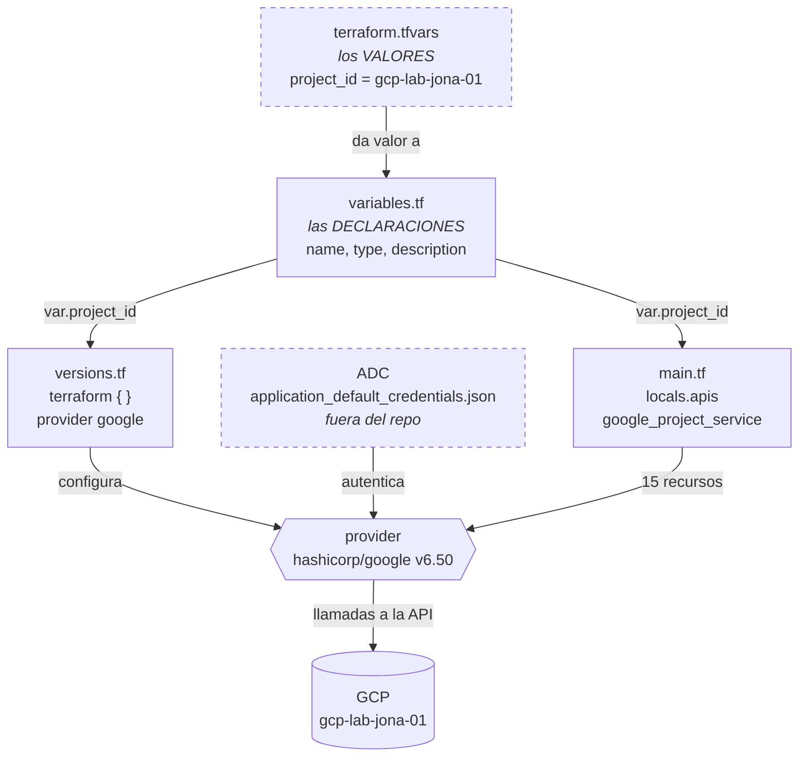
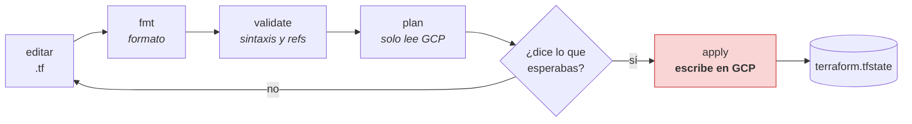
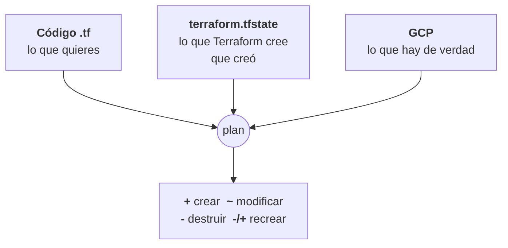

# Etapa 1 — Terraform y habilitación de APIs

Apuntes del ejercicio 1 del curso. El código está en [`terraform/`](../terraform/).

## Por qué las APIs van en Terraform

Un proyecto nuevo de GCP es una caja fuerte cerrada: no puedes crear una VM, un
cluster ni un dataset hasta habilitar la API del servicio correspondiente
(`compute.googleapis.com` para Compute Engine, por ejemplo). Google lo hace por
seguridad y para no saturar la interfaz con servicios que no usas.

Se puede activar a mano desde la consola, pero entonces el entorno **deja de ser
reproducible**: dentro de un mes nadie recuerda cuáles estaban activadas. En
Terraform, un `apply` deja el proyecto listo desde cero.

## Mapa conceptual

### 1. Quién alimenta a quién

Cuatro archivos con papeles distintos. Ninguno sirve solo.



Lo punteado no viaja a GitHub: `terraform.tfvars` y las credenciales.

### 2. El ciclo de trabajo



`init` va antes de todo esto y solo una vez por carpeta. De los cinco comandos,
**`apply` es el único que cambia algo** en GCP.

### 3. Qué compara el `plan`

Tres fuentes de verdad que pueden no coincidir:



Si alguien toca un recurso a mano desde la consola, `real` deja de coincidir con
`state` y el siguiente `plan` lo delata. Es la razón de no mezclar clics de
consola con infraestructura gestionada por Terraform.

> Los diagramas son Mermaid: GitHub los dibuja solo. En VS Code hace falta la
> extensión *Markdown Preview Mermaid Support*.

## Anatomía de los archivos

### `versions.tf` — el bloque `terraform { }`

Es el único bloque que **no crea nada**: configura la propia herramienta, no GCP.

- **`required_version`** — versión mínima de Terraform. En este PC, la 1.15.8.
- **`required_providers`** — un *provider* es el plugin que traduce HCL a
  llamadas a la API de un proveedor. `hashicorp/google` es el de Google Cloud, y
  se descarga solo al ejecutar `terraform init`.
- **`version = "~> 6.0"`** — el operador *pessimistic constraint*: acepta 6.1,
  6.50, 6.99… pero **nunca 7.0**. Los saltos de versión mayor traen cambios que
  rompen. El vídeo no fija versión, y por eso el mismo código puede fallarle a
  alguien dentro de seis meses.

### `provider "google" { }`

Configuración por defecto para todos los recursos: proyecto, región y zona. Así
no hay que repetir `project = ...` en cada recurso del archivo.

Lo importante es **lo que no hay**: ninguna clave, ningún JSON de credenciales,
ningún `credentials = "..."`. El provider lee las *Application Default
Credentials* que escribió `gcloud auth application-default login` en
`%APPDATA%\gcloud\application_default_credentials.json`.

Meter una clave dentro del `.tf` sería exactamente la mala práctica que el
ejercicio 15 del curso enseña a evitar: las credenciales no viajan al repo.

### `variables.tf` vs `terraform.tfvars`

Son las dos mitades de lo mismo y hacen falta las dos:

| Archivo | Contiene | ¿Va a git? |
|---|---|---|
| `variables.tf` | las **declaraciones** (nombre, tipo, descripción) | sí |
| `terraform.tfvars` | los **valores** | no, está en `.gitignore` |

Terraform carga `terraform.tfvars` automáticamente por llamarse así. Si se
llamara `lab.tfvars` habría que pasar `-var-file=lab.tfvars` en cada comando.

Un valor sin declaración solo produce un warning y se **ignora**:

```
Warning: Value for undeclared variable
  The root module does not declare a variable named "project_id" but a value
  was found in file "terraform.tfvars".
```

**Ninguna variable lleva `default`, a propósito.** Un `default = "gcp-lab-jona-01"`
parece cómodo, y es justo así como se acaban creando recursos en el proyecto
equivocado. Sin default, si falta el `tfvars` Terraform para y pregunta.

### `main.tf` — `for_each` sobre la lista de APIs

El vídeo repite el bloque `google_project_service` una vez por API. Con
`for_each` sobre una lista, añadir o quitar una API es tocar una línea:

```hcl
for_each = toset(local.apis)
service  = each.value
```

`toset()` convierte la lista en conjunto, que es lo que `for_each` espera. Cada
elemento genera su propia entrada en el estado.

Dos argumentos que importan:

- **`disable_on_destroy = false`** — con el valor por defecto (`true`), un
  `terraform destroy` **deshabilitaría** la API. Eso rompe cualquier recurso que
  siga vivo fuera de Terraform, y es un efecto colateral que no queremos en el
  ejercicio 20.
- **`disable_dependent_services = false`** — evita que Terraform intente apagar
  también las APIs que dependen de esta.

## Comentarios en HCL

```hcl
# Una línea. Es la convención en Terraform.
// También válido, estilo C. Se ve menos.
/* Bloque multilínea. */
```

`description` **no es un comentario**: en un `variable` o un `output` es un
argumento real, sale en `terraform console`, en los mensajes de error y en la
documentación que generan herramientas como `terraform-docs`. Un `#` solo lo lee
quien abre el archivo.

Regla práctica: qué *es* la variable → `description`. Por qué está escrita *así*
→ `#`.

## Comandos

### Desde dónde se lanzan

Desde la **raíz del proyecto**, en la terminal de PowerShell de VS Code:

```
PS C:\...\gcp-lab-jona-01>
```

El flag `-chdir=terraform` le dice a Terraform "trabaja en la carpeta
`terraform/`, pero yo estoy fuera". La alternativa es `cd terraform` y lanzar los
comandos sin el flag; hace lo mismo, pero deja la terminal dentro de esa carpeta
y luego hay que acordarse de salir para los `gcloud`.

### Los `.sh` de `scripts/` no se ejecutan

Son cuadernos de copiar y pegar. Los comandos van comentados con `#` para que no
pase nada si alguien lanza el archivo por error. En la terminal se pegan **sin el
`#` inicial**.

```bash
# terraform -chdir=terraform init      # descarga el provider
↑                                      ↑
comenta el comando entero              explica qué hace
(se quita al ejecutar)                 (nunca se ejecuta)
```

Si se pega la línea con el `#` de delante, PowerShell no hace nada y no da error.
Es fácil pensar entonces que el comando falló.

### El ciclo

| Comando | Cuándo | ¿Toca GCP? |
|---|---|---|
| `init` | al empezar, o al cambiar de provider | descarga plugins |
| `fmt` | después de editar un `.tf` | no |
| `validate` | antes de planear | no |
| `plan` | antes de aplicar | solo lee |
| `apply` | cuando el plan dice lo esperado | **sí, escribe** |

Bucle de trabajo: editar → `fmt` → `validate` → `plan` → leer → `apply`.
El `init`, solo la primera vez de cada carpeta.

```powershell
terraform -chdir=terraform init      # descarga el provider, crea .terraform/
terraform -chdir=terraform fmt       # reindenta al formato canónico (2 espacios)
terraform -chdir=terraform validate  # comprueba sintaxis y referencias
terraform -chdir=terraform plan      # muestra qué haría, sin tocar nada
terraform -chdir=terraform apply     # lo aplica, pidiendo confirmación
```

**`fmt`** reescribe los `.tf` con el formato canónico: 2 espacios y los `=`
alineados dentro de cada bloque. Imprime los archivos que ha cambiado; si no
imprime nada, ya estaban bien. Es el `gofmt` de Terraform: el estilo no se
discute, se ejecuta el comando.

**`validate`** comprueba que el código tiene sentido, sin hablar con GCP:
sintaxis HCL, que los tipos de recurso existan en el provider (un
`google_projet_service` mal escrito salta aquí) y que las referencias resuelvan
(`var.project_id` sin su bloque `variable`, `local.apis` sin su `locals`).
Esperado: `Success! The configuration is valid.`

**`plan`** es el primero que llama a la API de Google, pero solo para **leer**.
Compara tres cosas —el código, el estado (`terraform.tfstate`) y lo que hay de
verdad en GCP— y dice qué haría para que coincidan.

| Símbolo | Significa |
|---|---|
| `+` | crear |
| `-` | destruir |
| `~` | modificar en sitio |
| `-/+` | destruir y recrear (el peligroso) |

Termina con una línea resumen: `Plan: 15 to add, 0 to change, 0 to destroy.`

Leer siempre el `plan` antes del `apply`. Es la costumbre que separa a quien usa
Terraform de quien le da a `yes` a ciegas. En el ejercicio 20 el plan dirá
`12 to destroy` y esa lista se revisa con calma.

`apply` vuelve a calcular el plan, lo enseña otra vez y pide escribir `yes`.

## Archivos generados

| Archivo | ¿Va a git? | Por qué |
|---|---|---|
| `.terraform/` | no | providers descargados, cientos de MB |
| `.terraform.lock.hcl` | **sí** | fija versión exacta y hashes del provider |
| `terraform.tfstate` | no | inventario de la infra, a veces con secretos |

El repo del curso anterior tiene el `tfstate` subido a GitHub. Es un error común
y conviene no repetirlo.

## Comprobaciones de la etapa

```powershell
terraform -chdir=terraform state list
(gcloud services list --enabled --format="value(config.name)").Count
```

Esperado: una línea por API en el estado, y **≥ 10** APIs habilitadas en el
proyecto.
