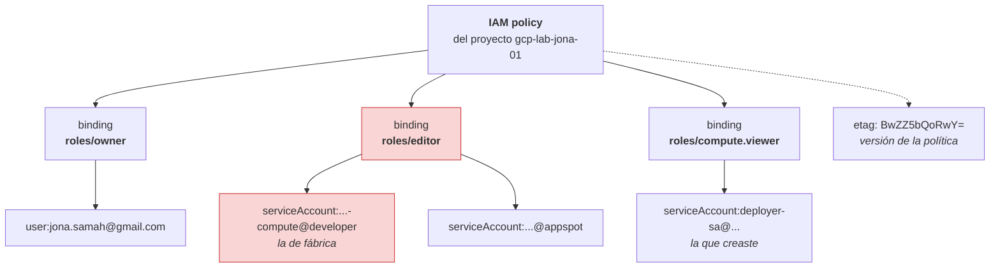
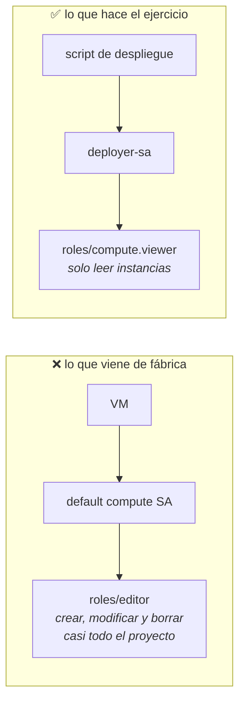

# Etapa 2 — Service accounts e IAM

Apuntes del ejercicio 2 del curso. Los comandos están en
[`scripts/etapa-02-service-account-iam.sh`](../scripts/etapa-02-service-account-iam.sh).

## Qué resuelve IAM

Dos preguntas: **quién** accede y **qué** puede hacer.

El *quién* puede ser una persona (una cuenta de Google) o una **service account**:
una identidad para máquinas y scripts, no para humanos. Su email tiene siempre
esta forma:

```
deployer-sa@gcp-lab-jona-01.iam.gserviceaccount.com
└── id ──┘ └──── project id ────┘
```

Una service account tiene una peculiaridad: es **identidad y recurso a la vez**.
Puede recibir permisos, y a la vez alguien puede tener permisos *sobre ella*
(por ejemplo, para suplantarla con `iam.serviceAccountUser`).

## Mapa conceptual

### La política del proyecto

Lo que la mayoría imagina es "un usuario con su lista de roles". La estructura
real va **al revés**: la política es una lista de *bindings*, y cada binding es
**un rol con N miembros**.



Por eso hace falta `--flatten="bindings[].members"` para filtrar: aplana esa
estructura anidada a **una fila por miembro**, y entonces el `--filter` puede
buscar dentro. Es un patrón que reaparece mucho en `gcloud`.

### El principio de mínimo privilegio



Si la identidad se ve comprometida, el atacante hereda **exactamente** lo que le
diste. Con `editor`, eso es el proyecto entero.

## El hallazgo: la cuenta por defecto ya trae `editor`

Al habilitar las APIs del ejercicio 1, Google creó solas varias *service agents*.
Una de ellas es la que usan **por defecto** todas las VMs que crees:

```powershell
gcloud projects get-iam-policy gcp-lab-jona-01 `
  --flatten="bindings[].members" `
  --filter="bindings.members:82408893781-compute@developer.gserviceaccount.com" `
  --format="value(bindings.role)"
```

```
roles/editor
```

Cualquier VM lanzada sin especificar service account arranca pudiendo crear,
modificar y borrar casi cualquier cosa del proyecto: buckets, bases de datos,
clusters. Si alguien compromete el nginx de esa máquina, hereda todo eso.

En un proyecto real, quitarle el `editor` a esa cuenta es de las primeras cosas
que se hacen. Aquí se deja como está para no romper los ejercicios 6 y 7, que
crean VMs con la cuenta por defecto igual que el vídeo.

## Los permisos son aditivos

No existe un "denegar" que reste lo concedido en otro nivel. Si tienes lectura
en la organización y escritura en el proyecto, **tienes las dos**. Un rol amplio
concedido arriba no se puede recortar abajo.

(Existen las *deny policies*, pero son un mecanismo aparte y poco habitual.)

## Los comandos

```powershell
# 1. Crear la identidad
gcloud iam service-accounts create deployer-sa --display-name="Deployer SA" --description="Identidad para despliegues automatizados del lab"

# 2. Darle UN rol, el mas pequeno que le sirve
gcloud projects add-iam-policy-binding gcp-lab-jona-01 --member="serviceAccount:deployer-sa@gcp-lab-jona-01.iam.gserviceaccount.com" --role="roles/compute.viewer"
```

El id (lo que va antes de la `@`) admite minúsculas, números y guiones, entre 6 y
30 caracteres. El `--display-name` es solo la etiqueta que se ve en la consola.

En PowerShell, cada comando en **una sola línea**. El `\` del final de línea que
usa el vídeo es sintaxis de bash y aquí no funciona.

### `add-iam-policy-binding` vs `set-iam-policy`

| | Qué hace | Riesgo |
|---|---|---|
| `add-iam-policy-binding` | **añade** un binding y respeta los demás | ninguno |
| `set-iam-policy` | **reemplaza** la política entera con un fichero | quitarte a ti mismo el `owner` sin querer |

El segundo comando escupe la política completa en YAML al terminar. No es un
error: hace *leer → modificar → escribir* y te enseña el resultado.

### El `etag`

```yaml
etag: BwZZ5bQoRwY=
```

Identifica la versión de la política. Si dos personas la modifican a la vez, la
segunda escritura falla porque su etag ya caducó, en vez de pisar el cambio de la
primera. Es control de concurrencia optimista, y es lo que hace seguro el
`add-iam-policy-binding` frente a editar un volcado a mano.

## Prefijos de miembro

| Prefijo | Para |
|---|---|
| `user:` | una persona |
| `serviceAccount:` | una identidad de máquina |
| `group:` | un grupo de Google Workspace |
| `domain:` | todo un dominio corporativo |

## Comprobaciones de la etapa

```powershell
gcloud iam service-accounts list --filter="email:deployer-sa"
gcloud projects get-iam-policy gcp-lab-jona-01 --flatten="bindings[].members" --filter="bindings.members:deployer-sa" --format="value(bindings.role)"
```

Esperado: 1 fila con `Deployer SA` y `DISABLED: False`, y `roles/compute.viewer`
como **único** rol.

Coste de la etapa: 0. No hay nada que apagar.

gcloud  iam  service-accounts  create  deployer-sa  --display-name="Deployer SA"  --description="..."
  │      │          │            │          │                │                          │
  │      │          │            │          │                │                          └─ texto libre, para el que lo lea dentro de un año
  │      │          │            │          │                └─ etiqueta visible en la consola web. Admite espacios y mayúsculas
  │      │          │            │          └─ EL ID. Posicional (sin --). Minúsculas, números y guiones, 6-30 caracteres
  │      │          │            └─ el verbo: create, delete, describe, list, update...
  │      │          └─ el tipo de recurso, siempre en plural
  │      └─ el producto: iam, compute, storage, run, sql, container...
  └─ la CLI

gcloud  projects  add-iam-policy-binding  gcp-lab-jona-01  --member="serviceAccount:deployer-sa@..."  --role="roles/compute.viewer"
  │        │                │                    │                        │           │                        │
  │        │                │                    │                        │           └─ el email completo, este sí entero
  │        │                │                    │                        └─ el prefijo dice QUÉ TIPO de miembro es
  │        │                │                    │                           user: / serviceAccount: / group: / domain:
  │        │                │                    └─ SOBRE QUÉ recurso se aplica: el proyecto entero
  │        │                └─ el verbo. Aquí no hay subgrupo: cuelga directo de projects
  │        └─ el producto
  └─ la CLI
