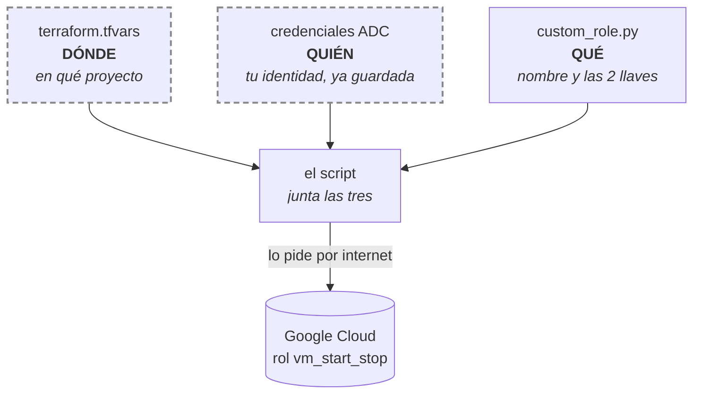
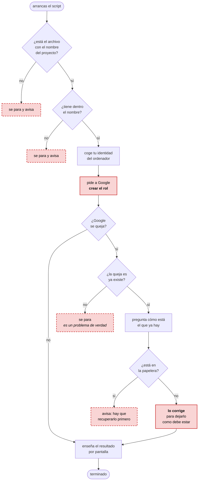

# Etapa 3 — Rol personalizado con Python

El código está en [`scripts/custom_role.py`](../scripts/custom_role.py) y los
comandos en [`scripts/etapa-03-rol-personalizado.sh`](../scripts/etapa-03-rol-personalizado.sh).

## La idea, con un manojo de llaves

Piensa en un **permiso** como una llave suelta: `compute.instances.start` es la
llave que enciende una máquina. Y en un **rol** como un manojo: varias llaves
juntas en una anilla, que se le entrega a alguien de una vez.

Google trae manojos ya montados, los **roles predefinidos**. El problema es que
casi siempre traen llaves de más. Si lo único que quieres es que un script pueda
encender y apagar máquinas por la noche, el manojo más pequeño de Google que
sirve es `roles/compute.instanceAdmin.v1`… y ese también lleva la llave de
**borrarlas**.

Un **rol personalizado** es un manojo que montas tú, llave por llave. Aquí, dos:

```
compute.instances.start    ← encender
compute.instances.stop     ← apagar
```

Y nada más. Es la misma idea del **mínimo privilegio** de la etapa 2, llevada un
paso más allá: allí elegiste el manojo de fábrica más pequeño; aquí fabricas el
manojo exacto.

Para que se vea la diferencia: sobre las máquinas existen **54 permisos**
distintos. El rol se queda con dos. Entre los que deja fuera hay algunos que
parecen inocentes y no lo son:

| Permiso que NO damos | Lo que dejaría hacer de verdad |
|---|---|
| `compute.instances.delete` | borrar la máquina |
| `compute.instances.setMetadata` | meter una clave de acceso y entrar dentro como administrador |
| `compute.instances.setServiceAccount` | cambiarle la identidad a la máquina |

Ese último enlaza con el hallazgo de la etapa 2: quien pueda cambiar la identidad
de una máquina le engancha la cuenta de fábrica, la que tiene `roles/editor`, y
desde dentro se queda con medio proyecto.

## Las tres cosas que el script necesita

El script no se inventa nada. Va a buscar tres cosas que ya existían y las junta.



- **Dónde** — el nombre del proyecto vive en un solo archivo del laboratorio,
  `terraform.tfvars`. El script lo lee de ahí en lugar de llevarlo escrito. Así,
  si algún día cambia, se toca un sitio y no diez.
- **Quién** — las **ADC** son tu identidad de Google, ya guardada en el ordenador
  desde el primer día del laboratorio. Por eso en el script no hay ninguna
  contraseña ni ninguna clave escrita.
- **Qué** — el nombre del rol y las dos llaves, escritos en el propio código.

Los dos recuadros con borde discontinuo **no se suben a GitHub**.

## Qué hace el script, paso a paso



En **rojo relleno**, los dos únicos pasos que cambian algo en Google: crear y
corregir. Todo lo demás pasa dentro de tu ordenador. En **rojo discontinuo**, las
cuatro formas de terminar mal.

Fíjate en que la mitad del dibujo son comprobaciones. Eso es lo normal: el trabajo
de verdad son dos cajas, y el resto es prever lo que puede salir torcido.

## Las dos situaciones raras

### "Esto ya existe" — el error 409

Los servicios de internet contestan con números. El **409** significa *ya existe
algo que se llama así*.

Si el script muriera ahí, lanzarlo dos veces daría error y habría que borrar el
rol a mano para repetir el ejercicio. En vez de eso, cuando ve un 409 pregunta
cómo está el rol que ya hay y lo deja como dice el código.

A eso se le llama que el script es **idempotente**: lo lances una vez o diez, el
resultado es el mismo y nunca revienta. Es una propiedad que se busca a propósito
en cualquier cosa que se ejecute sola.

### La papelera de siete días

Aquí hay una trampa. Un rol personalizado borrado **no desaparece de golpe**:
pasa **siete días en la papelera**, y durante esa semana su nombre sigue ocupado.

O sea, que un 409 tiene dos causas distintas:

| Lo que pasa de verdad | Qué hay que hacer |
|---|---|
| El rol existe y está vivo | corregirlo |
| El rol está borrado, en la papelera | **recuperarlo**, corregirlo no sirve |

Por eso el script no corrige a ciegas: primero pregunta en qué estado está. Si
está en la papelera, te dice el comando para sacarlo:

```powershell
gcloud iam roles undelete vm_start_stop --project=gcp-lab-jona-01
```

## Las piezas del script

El script tiene **dos funciones propias**. Todo lo demás son funciones prestadas
de librerías que otra gente escribió.

### `leer_project_id()`

Devuelve el nombre del proyecto, `gcp-lab-jona-01`, leyéndolo de
`terraform/terraform.tfvars`.

Existe por la norma del laboratorio: el nombre del proyecto vive en un solo
sitio y no se escribe a mano en ningún script. Hace tres cosas en orden:

| Paso | Si falla |
|---|---|
| ¿Existe el archivo? | se para y avisa |
| Buscar dentro la línea `project_id = "..."` | se para y avisa |
| Devolver lo que hay entre comillas | — |

Devuelve **solo el valor**, no la línea entera. De eso se encarga el paréntesis
de la expresión regular: `"([^"]+)"` significa "quédate con lo de dentro de las
comillas", y `.group(1)` lo recoge.

### `main()`

El guion de la película. No hace el trabajo, lo ordena:

1. Pide el nombre del proyecto a la función anterior.
2. Coge tu identidad del ordenador.
3. Se conecta al servicio de IAM.
4. Intenta crear el rol.
5. Si Google se queja, decide qué hacer.
6. Enseña el resultado.

Devuelve un **número**, no un texto: `0` si todo fue bien, `1` si el rol estaba
en la papelera. Es una convención de toda la vida en los sistemas operativos —
cero es éxito, cualquier otro número es un problema. Sirve para que otro script
pueda encadenarse detrás y saber si sigue o no.

### Las funciones prestadas

Para leer el archivo:

| Función | Para qué |
|---|---|
| `Path(__file__).resolve()` | la ruta completa de este mismo script |
| `.parent.parent` | sube dos carpetas: a `scripts/`, y de ahí a la raíz |
| `RAIZ / "terraform" / "terraform.tfvars"` | pega trozos de ruta; la barra vale en Windows y en Linux |
| `.exists()` | ¿está el archivo? |
| `.read_text()` | devuelve todo el contenido como un texto |
| `re.search()` | busca un patrón dentro de ese texto |
| `sys.exit()` | corta el script en seco con un mensaje |

Ese `.parent.parent` es lo que hace que el script funcione desde cualquier
carpeta: no busca el `tfvars` "donde estés tú", sino a partir de dónde está él.

Para hablar con Google:

| Función | Para qué |
|---|---|
| `google.auth.default()` | busca tus credenciales ADC y te las da |
| `discovery.build("iam", "v1", ...)` | se descarga el manual del servicio y fabrica las órdenes |
| `.create()` | pide crear el rol |
| `.get()` | pregunta cómo está un rol que ya existe |
| `.patch()` | corrige campos sueltos de un rol existente |
| `.execute()` | **manda de verdad la petición** |

Cuidado con el último. `create()`, `get()` y `patch()` **no hacen nada por sí
solas**: solo preparan el sobre. Hasta que no se llama a `.execute()` no sale
nada hacia Google. Por eso todas las líneas terminan igual:

```python
roles.create(...).execute()
```

Si se olvidara el `.execute()`, el script correría sin dar error y sin crear
nada. Es un fallo silencioso de los que cuesta ver.

### La línea rara del final

```python
if __name__ == "__main__":
    raise SystemExit(main())
```

Se lee así: *si me están ejecutando directamente, corre `main()` y termina con
el número que devuelva*.

El `if` está porque un archivo de Python se puede usar de dos formas:
ejecutarlo, o importarlo desde otro script para reutilizar sus funciones. Sin
esa línea, el simple hecho de importarlo crearía el rol sin que nadie lo
hubiera pedido, que es lo último que quieres.

Y `raise SystemExit(...)` convierte ese `0` o `1` en el código de salida real
del proceso, el que ve PowerShell. Se puede comprobar justo después de lanzarlo:

```powershell
python scripts/custom_role.py
$LASTEXITCODE
```

Sale `0` si terminó bien.

## Tres detalles del código

**Se corrigen campos sueltos, no la ficha entera.** Cuando el script corrige un
rol que ya existía, no manda "aquí tienes el rol nuevo, sustitúyelo". Manda "toca
solo estos cuatro campos". Eso se llama `updateMask`.

Es la misma prudencia del `etag` de la etapa 2: cambiar lo justo en vez de
reemplazar el objeto completo, que es lo que hace peligroso al `set-iam-policy`.

**El manual se descarga al momento.** La librería de Python que usa el script no
lleva escritas las órdenes de IAM. Se baja la descripción del servicio y las
fabrica sobre la marcha.

Tiene una ventaja y un inconveniente. La ventaja: **una sola librería vale para
todos los servicios de Google**. El inconveniente: como las órdenes no existen
hasta que el script corre, VS Code no puede avisarte si escribes una mal. No hay
autocompletado y el fallo aparece al ejecutar, no antes.

**El nombre lleva guion bajo, no guion.** `vm_start_stop`, y no
`vm-start-stop`. Los roles personalizados no admiten el guion normal. Es una
excepción a la norma del laboratorio, que pide guiones para todo lo que va a
Google. Comparado con la etapa 2:

| | Qué admite | Longitud |
|---|---|---|
| nombre de service account | minúsculas, números y **guion** | 6-30 |
| nombre de rol personalizado | letras, números, **guion bajo** y punto | 3-64 |

Los dos son **inmutables**: elegido el nombre, no se cambia. Para "renombrarlos"
hay que crear otro y borrar el viejo.

## Comprobación de la etapa

```powershell
gcloud iam roles describe vm_start_stop --project=gcp-lab-jona-01
```

Tiene que salir `stage: GA` y **exactamente dos** permisos:
`compute.instances.start` y `compute.instances.stop`. Ni uno más.

(`stage` es solo una etiqueta que dice en qué punto de su vida está el rol:
`ALPHA`, `BETA`, `GA` —terminado— o `DISABLED`. La única que hace algo es la
última: un rol en `DISABLED` deja de dar permisos sin necesidad de borrarlo.)

Coste de la etapa: **0**. Un rol no cuesta dinero y no hay nada que apagar.
