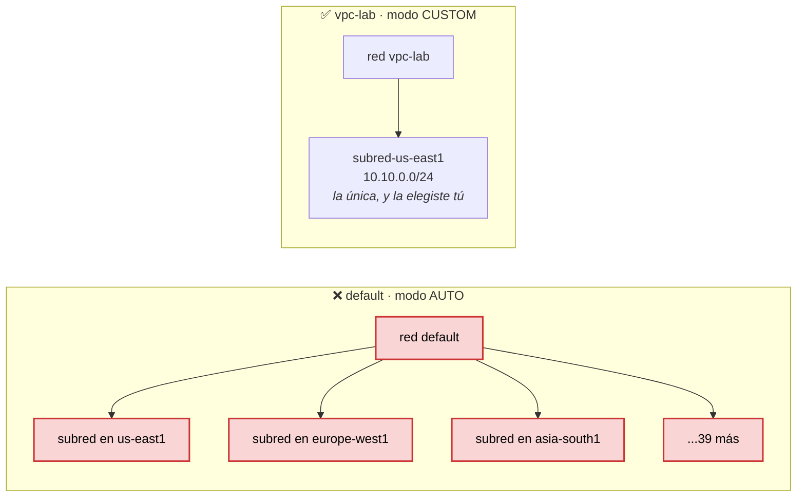
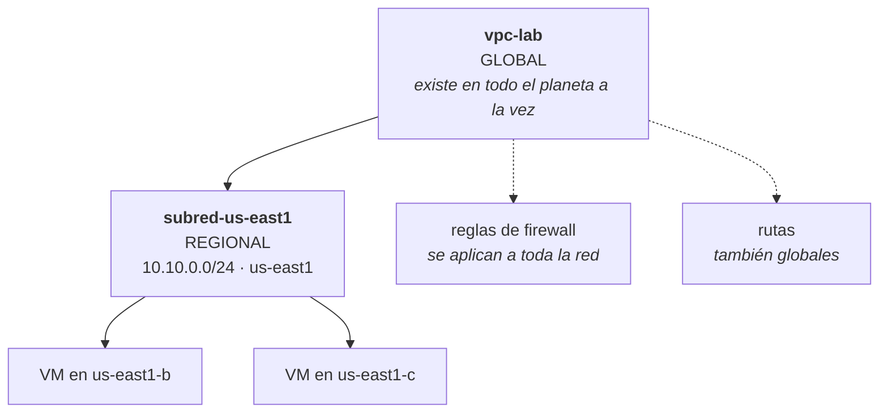

# Etapa 4 — VPC en modo custom

El código está en [`terraform/network.tf`](../terraform/network.tf) y los
comandos en [`scripts/etapa-04-vpc-custom.sh`](../scripts/etapa-04-vpc-custom.sh).

## La idea: la red que te regalan y la que montas tú

Cuando habilitaste la API de Compute en la etapa 1, Google te creó una red sin
preguntar. Se llama `default` y viene en **modo auto**: una subred en **cada
región del mundo**, con rangos de direcciones que eligió Google.

En tu proyecto son **42 subredes**. Ninguna la pediste y ninguna vas a usar.

Una red en **modo custom** hace lo contrario: nace vacía. Tú decides cuántas
subredes hay, en qué regiones y con qué rango. Eso es lo que hace el ejercicio, y
es lo que se usa en cualquier proyecto serio.



### Por qué importa, más allá de la limpieza

Tener 42 subredes que no usas no cuesta dinero. El problema aparece después, y
son tres:

- **Los rangos los eligió Google.** El día que conectes esta red con otra —la de
  otra empresa, la de tu oficina— es fácil que los rangos **choquen**. Dos redes
  con el mismo `10.128.0.0/20` no se pueden unir. Y el rango de una subred no se
  puede cambiar después.
- **Superficie que no controlas.** Cada subred es un sitio donde alguien puede
  arrancar una máquina. Cuantos menos sitios, más fácil vigilarlos.
- **No es reproducible.** Lo que Google decide hoy puede cambiar mañana: si
  añaden una región, tu red crece sola. Una red custom es exactamente la que
  escribiste, hoy y dentro de dos años.

## La red es global, la subred es regional

Este es el punto que más se atraganta al venir de otros sitios.



La **red** no vive en ninguna región: es un objeto global. Las **subredes** sí
son regionales, y son las que reparten direcciones a las máquinas. El firewall y
las rutas cuelgan de la red, no de la subred, así que una regla que escribas
afecta a todas las subredes que tenga.

Consecuencia práctica: dos máquinas en subredes de continentes distintos, dentro
de la misma red, **se hablan por dirección interna** sin salir a internet.

## Las cuentas del `10.10.0.0/24`

El `/24` del final dice **cuántos bits de la dirección están fijos**: 24 de 32.
Quedan 8 bits libres, y 2 elevado a 8 son **256 direcciones**, de la `10.10.0.0`
a la `10.10.0.255`.

Pero no puedes usar las 256. Google se queda con cuatro:

| Dirección | Para qué |
|---|---|
| `10.10.0.0` | identifica la red; no se asigna a nadie |
| `10.10.0.1` | la puerta de salida, el *gateway* |
| `10.10.0.254` | reservada por Google para uso futuro |
| `10.10.0.255` | difusión, el *broadcast* |

Quedan **252 direcciones útiles**. De sobra para el laboratorio.

Dos detalles que valen para toda la vida:

- **Cuanto más grande el número, más pequeña la red.** Un `/24` son 256
  direcciones y un `/16` son 65.536. Es al revés de lo que parece.
- **El rango se puede agrandar, nunca encoger.** Si te quedas corto hay un
  comando para ampliarlo; si te pasas, hay que crear otra subred. Por eso se
  empieza pequeño.

## Lo que Google crea solo, y lo que no

Al crear la red, Google añadió **dos rutas** sin que se las pidieras:

```
NAME                              DEST_RANGE    NEXT_HOP                  PRIORITY
default-route-efcabeb7196f962f    0.0.0.0/0     default-internet-gateway  1000
default-route-r-9bf9f41280941c62  10.10.0.0/24                            0
```

- La segunda es la **ruta de la subred**: dice "lo que vaya a `10.10.0.0/24` se
  queda dentro". Prioridad `0`, la máxima. Aparece y desaparece con la subred.
- La primera es la **salida a internet**: "todo lo demás, a la puerta de salida".
  `0.0.0.0/0` significa *cualquier destino*, y por eso tiene prioridad `1000`,
  baja: es la última opción, la que se usa cuando ninguna otra ruta encaja.

Si algún día quieres una red **sin salida a internet**, esa primera ruta se
puede evitar al crearla con `delete_default_routes_on_create`.

### Y ahora lo importante: no hay ni una regla de firewall

```powershell
gcloud compute firewall-rules list --filter="network:vpc-lab"
```

Devuelve **vacío**. Compáralo con la `default`, que trae cuatro:
`default-allow-icmp`, `default-allow-internal`, `default-allow-rdp` y
`default-allow-ssh`.

Eso significa que en `vpc-lab`, ahora mismo:

| Dirección del tráfico | Qué pasa |
|---|---|
| **Entrante** | **todo bloqueado**, incluido el SSH |
| **Saliente** | todo permitido |

No es un descuido del ejercicio: es el comportamiento por diseño de una red
custom. Sin reglas, no entra nada. Una máquina que arrancaras aquí hoy no la
podrías ni tocar.

De eso va la **etapa 5**: abrir el puerto 22, y solo a las máquinas que lleves
etiquetadas.

## El archivo, campo a campo

```hcl
resource "google_compute_network" "vpc_lab" {
  name                    = "vpc-lab"
  auto_create_subnetworks = false
  routing_mode            = "REGIONAL"
  depends_on              = [google_project_service.apis]
}
```

| Campo | Qué hace |
|---|---|
| `name` | el nombre que ve Google. Con guion, y no se puede cambiar |
| `auto_create_subnetworks = false` | **el ejercicio entero**. Con `true` tendrías las 42 subredes |
| `routing_mode` | `REGIONAL` es el valor por defecto; está escrito para que se vea que existe `GLOBAL` |
| `depends_on` | no crear la red antes de que la API de Compute esté encendida |

Fíjate en la diferencia entre `vpc-lab` y `vpc_lab`. El primero es el nombre que
viaja a Google, con guion. El segundo es la **etiqueta local** de Terraform, con
guion bajo, y solo existe dentro de los archivos `.tf`. Es la norma del
laboratorio y aquí se ven las dos juntas.

Y en la subred:

```hcl
network = google_compute_network.vpc_lab.id
```

No pone `"vpc-lab"` en texto: **apunta al recurso**. Gracias a eso Terraform sabe
solo que la red va primero y la subred después. Por eso en el `plan` el campo
salía como `(known after apply)` — todavía no existía el identificador que iba a
rellenar ese hueco.

## Comprobaciones de la etapa

```powershell
gcloud compute networks describe vpc-lab --format="value(x_gcloud_subnet_mode)"
gcloud compute networks subnets list --filter="network:vpc-lab"
```

Esperado: `CUSTOM`, y **una sola** subred `subred-us-east1` con `10.10.0.0/24` en
`us-east1`.

Las dos redes lado a lado, que es donde se ve todo de un vistazo:

```powershell
gcloud compute networks list --format="table(name,x_gcloud_subnet_mode)"
```

Coste de la etapa: **0**. Ni la red ni la subred se facturan. Lo que cuesta
dinero son las direcciones externas y el tráfico de salida, y eso llega en el
módulo 2.
