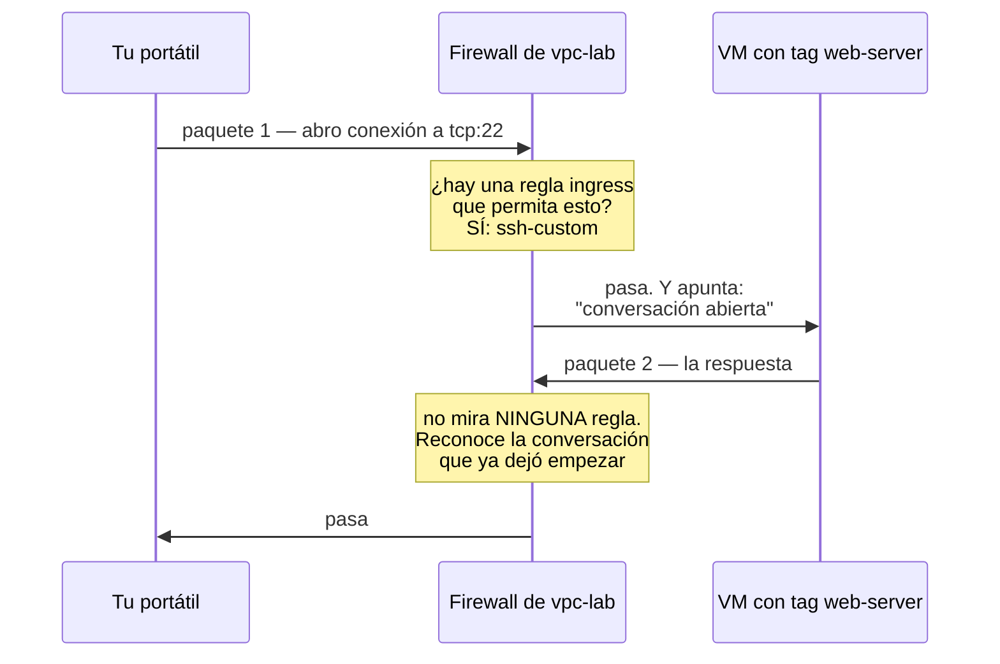
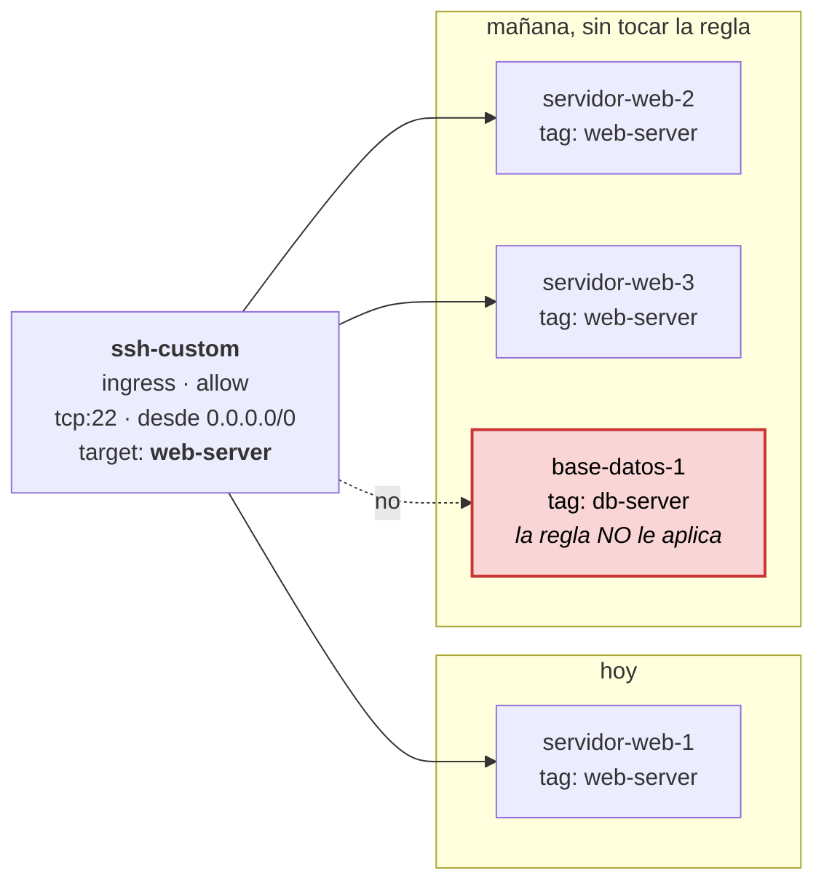
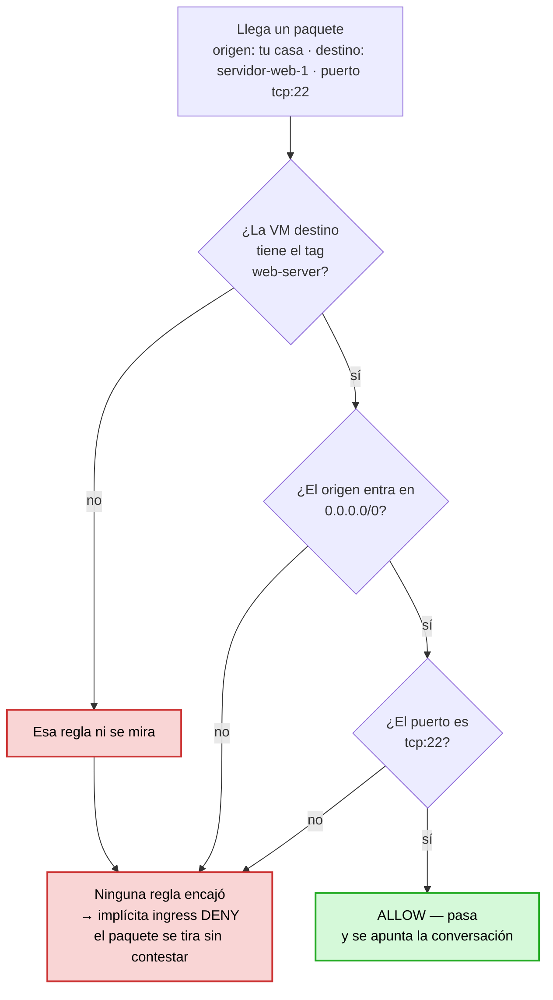

# Etapa 5 — Firewall y network tags

El comando de esta etapa va en
[`scripts/etapa-05-firewall-network-tags.sh`](../scripts/etapa-05-firewall-network-tags.sh),
como cuaderno de copiar y pegar. Aquí no hay Terraform: la regla se crea con
`gcloud`, igual que en el vídeo.

> **De qué va la etapa, en una frase:** la red que creaste en la etapa 4 no deja
> entrar absolutamente nada, y aquí abres el primer agujero — pero solo el
> puerto 22, y solo para las máquinas que tú marques con una etiqueta.

Si al terminar solo te quedas con esa frase, ya has entendido el ejercicio. El
resto del documento es desmontarla pieza a pieza.

---

## 1. Antes de nada: qué es un firewall

Un **firewall** es un portero que mira cada paquete que intenta cruzar y decide
si pasa o no pasa. Nada más. No cifra, no autentica a nadie, no mira quién eres:
mira **de dónde viene el paquete, a dónde va y por qué puerto**, y con esos tres
datos consulta una lista.

En GCP ese portero no está en un aparato aparte, como en una oficina. Está
**pegado a cada máquina virtual**, en su tarjeta de red virtual. Eso tiene una
consecuencia que sorprende y que verás repetida más abajo: **dos máquinas de la
misma subred también pasan por el portero para hablarse entre ellas**. Estar "en
la misma red" no es un salvoconducto.

### Qué es un puerto

Una dirección IP identifica **una máquina**. Un puerto identifica **un servicio
dentro de esa máquina**. La IP es el edificio; el puerto, el número del piso.

Una misma máquina puede tener a la vez un servidor web escuchando en el 80 y un
servidor SSH escuchando en el 22, sin estorbarse, porque son pisos distintos.

Los que vas a usar en este laboratorio:

| Puerto | Servicio | Dónde aparece |
|---|---|---|
| **22** | SSH, la consola remota | esta etapa |
| **80** | HTTP, web sin cifrar | etapa 6, el nginx |
| 443 | HTTPS, web cifrada | Cloud Run, etapa 12 |
| 3389 | RDP, escritorio remoto de Windows | solo en la red `default` |
| 5432 | PostgreSQL | etapa 16, Cloud SQL |

Y un caso aparte: el **ping** no usa puertos. Va por un protocolo distinto,
ICMP, y por eso en una regla se escribe `--rules=icmp` a secas, sin `:número`.

> **Resumen del punto 1:** el firewall decide por *origen*, *destino* y *puerto*.
> Está pegado a cada VM, no en la frontera de la red.

---

## 2. Ingress y egress: desde dónde se mira

Estas dos palabras aparecen en todas las reglas y confundirlas lo estropea todo.
La clave es **desde dónde se mira**: siempre desde la máquina, nunca desde ti.

| Palabra | Significa | Ejemplo |
|---|---|---|
| **ingress** | tráfico que **entra** en la VM | tú abres una sesión SSH hacia el servidor |
| **egress** | tráfico que **sale** de la VM | la VM hace `apt-get update` contra internet |

El error clásico es pensar "yo estoy saliendo hacia la máquina, luego es egress".
No: la dirección se nombra **desde el punto de vista de la máquina protegida**.
Tú conectando al servidor es **ingress**, siempre.

Truco para no fallar: pregúntate *¿en qué dirección va el primer paquete, el que
abre la conversación?* Si entra en la VM, es ingress.

> **Resumen del punto 2:** ingress = entra en la VM. Egress = sale de la VM. Se
> mira desde la máquina.

---

## 3. Las dos reglas que no ves

Aquí está la razón de que la etapa 4 terminara diciendo que en `vpc-lab` no entra
nada.

Cuando listas las reglas de tu red, no sale ninguna:

```powershell
gcloud compute firewall-rules list --filter="network:vpc-lab"
```

Y sin embargo la red **sí** se comporta de una manera concreta, porque toda VPC
de GCP —incluida la tuya recién nacida— tiene dos reglas **implícitas**. No salen
en ningún listado, no se pueden borrar, no se pueden modificar:

| Dirección | Acción | Prioridad |
|---|---|---|
| **ingress** (lo que entra) | **DENY** — bloqueado | 65535 |
| **egress** (lo que sale) | **ALLOW** — permitido | 65535 |

Léelas otra vez despacio, porque de ahí sale todo:

- **Todo lo que intente entrar está prohibido** mientras tú no digas lo contrario.
- **Todo lo que quiera salir está permitido** mientras tú no digas lo contrario.

Por eso la red vacía de la etapa 4 no dejaba entrar ni el SSH. No era un fallo ni
un olvido: es el diseño.

### La consecuencia en la forma de trabajar

**El firewall de GCP se escribe en positivo.**

Vienes con el modelo mental de "voy a cerrar los puertos peligrosos". Aquí no
hace falta: **todos los puertos nacen cerrados**. Lo que haces es lo contrario,
abrir agujeros de uno en uno, y cada agujero es una regla que escribes tú.

Esa inversión es la idea más importante del documento, y es la misma que ya
apareció en las etapas 2 y 3 con los permisos: **partir de nada y añadir lo
mínimo**, en vez de partir de todo e ir quitando.

> Curiosidad que confirma la regla: el puerto **25 saliente** (SMTP, correo)
> está bloqueado por Google en Compute Engine y **no hay regla que lo abra**. Si
> algún día montas algo que mande correo y no sale, no es tu firewall: es la
> plataforma.

> **Resumen del punto 3:** sin reglas escritas, entra nada y sale todo. Las
> reglas se escriben para *permitir*, no para prohibir.

---

## 4. La prioridad: el orden de la cola

Cada regla lleva un número de **prioridad**, de `0` a `65535`.

La norma es corta pero se recuerda al revés la mitad de las veces:

> **Cuanto más bajo el número, más manda la regla.**

El firewall coge todas las reglas que podrían aplicar a ese paquete, las ordena
de menor número a mayor, y **la primera que encaja decide**. No sigue mirando.

Por eso las reglas implícitas tienen **65535**, el número más alto posible: son
la última palabra, la que se aplica solo cuando ninguna otra ha encajado. Están
al final de la cola a propósito.

Tu regla `ssh-custom` no lleva `--priority`, así que nace con **1000**, el valor
por defecto. Y 1000 está elegido con cabeza: deja hueco **a los dos lados**.

```
   0  ┐ más manda
 100  │   ← una regla de emergencia que tape todo lo demás
 500  │   ← un deny puntual, para cerrar algo sin borrar la regla de abajo
1000  │   ← ssh-custom, tu regla (el valor por defecto)
      │
65535 ┘ menos manda   ← las implícitas: ingress deny, egress allow
```

Un ejemplo para verlo:

- Tienes `ssh-custom` con prioridad 1000, que permite el 22 a `web-server`.
- Un día quieres cortar el SSH a una máquina concreta sin borrar la regla.
- Creas un `deny` de prioridad 500 apuntado a otra etiqueta, `en-cuarentena`.
- Le pones esa etiqueta a la máquina. Como 500 va antes que 1000, gana el deny.

Y una regla de desempate: **si dos reglas empatan en prioridad, gana el `deny`**.
La seguridad se decide siempre por lo restrictivo.

> **Resumen del punto 4:** número bajo = más fuerte. Por defecto 1000. Las
> implícitas son 65535, las últimas de la cola.

---

## 5. Stateful: por qué basta una regla de entrada

Este es el punto que más ahorra trabajo y el que menos se entiende a la primera.

El firewall de GCP es **stateful**, "con estado". Significa que **apunta las
conversaciones que ha dejado empezar**, y una vez apuntadas, deja pasar la
respuesta sin volver a consultar ninguna regla.



Piénsalo como un portero con una libreta. Cuando deja entrar a alguien, apunta su
nombre. Cuando esa persona sale, no vuelve a pedirle el DNI: la tiene apuntada.

**Qué te ahorra:** en un firewall *sin* estado tendrías que escribir dos reglas
por cada servicio, una de ida y otra de vuelta, y además abrir de vuelta el rango
de puertos altos, que es donde el cliente espera la respuesta. Aquí escribes
**una sola regla de entrada** y el SSH ya funciona en las dos direcciones.

### ⚠ El matiz que se cuela

Lo *stateful* cubre la **respuesta a una conversación que ya empezó**. No cubre
las conversaciones que empieza la propia máquina.

Cuando la VM hace `apt-get update`, ese es un paquete **nuevo, saliente, iniciado
por ella**. No es la respuesta de nada. Lo que lo autoriza no es la regla
`ssh-custom` ni el hecho de ser stateful: lo autoriza la **regla implícita de
egress allow** del punto 3.

| Situación | Quién lo autoriza |
|---|---|
| Tú abres SSH hacia la VM | `ssh-custom` (regla ingress que escribiste) |
| La VM te contesta en esa sesión | nadie: es stateful, ya está apuntada |
| La VM hace `apt-get update` | la implícita de **egress allow** |
| El repositorio de Debian contesta al `apt-get` | nadie: es stateful |

Son dos mecanismos distintos que a menudo se mezclan en la cabeza.

> **Resumen del punto 5:** basta una regla de entrada porque la respuesta va
> sola. Lo que la VM inicia hacia fuera lo permite la implícita de egress.

---

## 6. El origen: `--source-ranges`, y un repaso del CIDR

Una regla ingress necesita responder a dos preguntas, y son dos flags distintos.
La primera es: **¿de dónde puede venir el tráfico?**

Eso es `--source-ranges`, y se escribe en la misma notación CIDR de la etapa 4,
la del `10.10.0.0/24`. Repaso, porque aquí la vas a usar en sus dos extremos:

El número de después de la barra dice **cuántos bits están fijos**, de 32. Los
que quedan libres son las direcciones que abarca.

| Escrito así | Bits fijos | Cuántas direcciones | Qué significa |
|---|---|---|---|
| `0.0.0.0/0` | **0** | **todas** | cualquier dirección de internet |
| `10.10.0.0/24` | 24 | 256 | tu subred de la etapa 4 |
| `35.235.240.0/20` | 20 | 4.096 | el rango del túnel IAP de Google |
| `88.12.34.56/32` | **32** | **1** | una sola dirección, la tuya |

Los dos extremos son los que más se usan: `/0` es "todo el mundo" y `/32` es "una
máquina exacta". Y se mantiene lo de la etapa 4: **cuanto más grande el número,
más pequeño el conjunto**.

El comando de esta etapa usa `--source-ranges=0.0.0.0/0`, o sea, **cualquiera**.
Volveremos sobre eso en el punto 10, porque tiene su miga.

> **Resumen del punto 6:** `--source-ranges` es el **origen**. `/0` es todo
> internet, `/32` es una sola dirección.

---

## 7. El destino: los network tags

La segunda pregunta de una regla ingress es: **¿a qué máquinas protege?**

### El problema, con números

Imagina 100 servidores web y 50 bases de datos, como en el vídeo. Si las reglas
se escribieran por dirección IP:

- harían falta **150 reglas**, una por máquina;
- cada máquina nueva obligaría a escribir otra;
- cada máquina que muere deja una regla huérfana apuntando a una IP que ahora
  puede ser de otro;
- y las IP de las VMs **cambian** cuando se recrean.

Es inmantenible. No es que sea trabajoso: es que está mal.

### La solución

Un **network tag** es una etiqueta de texto que se pega a una VM. La regla no
apunta a máquinas concretas, apunta a **la etiqueta**:



La regla se escribe **una sola vez**. A partir de ahí:

- una máquina nueva con el tag `web-server` queda cubierta **desde el primer
  segundo**, sin tocar nada;
- una máquina sin ese tag no está cubierta, aunque esté en la misma subred;
- las máquinas entran y salen del alcance de la regla **en caliente**, sin
  reiniciar:

```powershell
gcloud compute instances add-tags servidor-web-1 --tags=web-server --zone=us-east1-b
gcloud compute instances remove-tags servidor-web-1 --tags=web-server --zone=us-east1-b
```

Esto es lo que hace que el MIG de la etapa 7 funcione: crea y destruye máquinas
solo, todas nacen con el tag de la plantilla, y nadie tiene que tocar el firewall
nunca.

### Reglas del nombre

Minúsculas, números y **guion**; hasta 63 caracteres; máximo 64 etiquetas por
instancia.

Encaja con la convención del laboratorio, así que `web-server` va con guion — a
diferencia del rol `vm_start_stop` de la etapa 3, que era la excepción con guion
bajo.

> **Resumen del punto 7:** `--target-tags` es el **destino**. La regla apunta a
> una etiqueta, no a máquinas, y por eso escala.

---

## 8. Origen y destino: no los confundas

Los dos flags anteriores son los que más se mezclan, así que aquí van juntos y
sin adornos:

| Flag | Responde a | En el comando |
|---|---|---|
| `--source-ranges` | ¿**de dónde viene** el tráfico? | `0.0.0.0/0` = de cualquier sitio |
| `--target-tags` | ¿**a qué llega**, a quién protejo? | `web-server` = solo esas VMs |

Una regla ingress necesita **los dos**. Si solo dices el origen, la regla se
aplicaría a todas las máquinas de la red; si solo dices el destino, entraría
cualquiera.

Dicho de otra forma: `--source-ranges` es *quién llama a la puerta* y
`--target-tags` es *de qué puertas estamos hablando*.

---

## 9. El comando entero, flag a flag

```powershell
gcloud compute firewall-rules create ssh-custom --network=vpc-lab --action=allow --direction=ingress --rules=tcp:22 --source-ranges=0.0.0.0/0 --target-tags=web-server
```

En **una sola línea**. El `\` de final de línea que usa el vídeo es de bash;
PowerShell no lo entiende y te partiría el comando.

| Flag | Qué hace | Si no lo pones |
|---|---|---|
| `ssh-custom` | el nombre de la regla, único en el proyecto | error: es obligatorio |
| `--network=vpc-lab` | de qué red cuelga la regla | iría a la red `default`, no a la tuya |
| `--action=allow` | permitir. La alternativa es `deny` | error: es obligatorio |
| `--direction=ingress` | tráfico que **entra** | es el valor por defecto, así que igual; se escribe para que se vea que existe `egress` |
| `--rules=tcp:22` | protocolo y puerto | error: es obligatorio |
| `--source-ranges=0.0.0.0/0` | el **origen**: cualquiera | en ingress, gcloud asume `0.0.0.0/0`; mejor escribirlo |
| `--target-tags=web-server` | el **destino**: solo esas VMs | **la regla se aplicaría a TODAS las máquinas de la red** |

La última fila es la importante. Sin `--target-tags`, la regla protege —o mejor
dicho, expone— absolutamente todo lo que arranques en `vpc-lab`, ahora y en el
futuro. Es un despiste caro.

### El campo que no está: la prioridad

No pusiste `--priority`, así que la regla nace con **1000**. Ver el punto 4.

### Formas de escribir `--rules`

| Escrito así | Significa |
|---|---|
| `tcp:22` | solo el puerto 22 por TCP |
| `tcp:80,tcp:443` | dos puertos |
| `tcp:8000-8080` | un rango de puertos |
| `icmp` | ping; ICMP no tiene puertos |
| `all` | todo. Muy peligroso, casi nunca es lo que quieres |

---

## 10. El viaje de un paquete, paso a paso

Para asentarlo, sigue un paquete tuyo desde casa hasta la máquina. Esto es
exactamente lo que hará el firewall cuando llegue la etapa 6.



Fíjate en la caja roja de abajo: **el paquete se tira sin contestar nada**. Eso
tiene una consecuencia práctica que te va a pasar en la etapa 6.

Si el paquete fuera al puerto 80, para el que no hay regla, no recibirías un "no"
rápido. **No recibirías nada**: el navegador se queda cargando y acaba en un
`ERR_TIMED_OUT`. Es distinto de un "conexión rechazada", que significa que el paquete sí
llegó a la máquina y allí no había nadie escuchando.

| Síntoma | Qué suele ser |
|---|---|
| se queda cargando y expira | **el firewall**: el paquete no llegó |
| "connection refused" al instante | llegó a la VM, pero el servicio no está escuchando |
| responde pero con error 500 | llegó, hay servicio, y el problema es de la aplicación |

Esa tabla te va a ahorrar media hora en la etapa 6.

---

## 11. ⚠ Tres cosas que el vídeo no dice

### ⚠ a) `0.0.0.0/0` en el puerto 22 es abrir el SSH a todo internet

En el laboratorio no pasa nada. En un proyecto real es el hallazgo número uno de
cualquier auditoría, y no es teórico: hay bots barriendo el rango de direcciones
de GCP a todas horas buscando exactamente esto.

Las dos formas serias de escribirlo:

```powershell
# opción 1: solo desde tu casa
--source-ranges=TU.IP.PUBLICA/32

# opción 2: solo a través del túnel de Google
--source-ranges=35.235.240.0/20
```

La opción 1 usa el `/32` del punto 6: una sola dirección. Tiene un problema
práctico, y es que la IP de tu casa cambia cada cierto tiempo.

La opción 2 es la buena. `35.235.240.0/20` es el rango fijo desde el que **IAP
TCP forwarding** de Google abre el túnel. Con eso:

- la VM no necesita ni IP externa;
- el SSH viaja por dentro de la red de Google;
- y quien decide si pasas es **IAM**, es decir, tu identidad — no una lista de
  direcciones que cualquiera puede falsear.

Fíjate en que eso enlaza con las etapas 2 y 3: la autorización acaba siendo
siempre una cuestión de identidad, no de dónde estás.

### ⚠ b) Un network tag no es seguridad de verdad

Una etiqueta es **solo un texto**. No hay nada que verificar, no es una
credencial, no está firmada.

Quien tenga el permiso `compute.instances.setTags` sobre una VM puede ponerle
`web-server` y con eso se ha metido él solito dentro del alcance de tu regla. Es
el mismo tipo de problema que los permisos peligrosos de la
[etapa 3](apuntes-etapa-03-rol-personalizado.md).

Por eso GCP ofrece tres tipos de destino, de peor a mejor:

| Destino de la regla | Cómo se decide | Robustez |
|---|---|---|
| todas las instancias de la red | por defecto, si no pones nada | la más burda: expone todo |
| **network tags** | un texto pegado a la VM | cómoda; la de esta etapa |
| **service accounts** | la identidad con la que corre la VM | la buena |

La versión con identidad se escribe así, y enlaza directo con la
[etapa 2](apuntes-etapa-02-service-accounts-iam.md):

```powershell
--target-service-accounts=deployer-sa@gcp-lab-jona-01.iam.gserviceaccount.com
```

Es más robusta porque cambiar la identidad de una VM exige el permiso
`iam.serviceAccountUser` sobre esa cuenta, mucho más difícil de conseguir que
escribir una palabra.

**No se pueden mezclar** tags y service accounts en la misma regla: o una cosa o
la otra.

### ⚠ c) Dos VMs de la misma subred tampoco se hablan

Esto pilla a todo el mundo. El firewall está pegado a **cada** máquina, no en la
frontera de la red, así que se aplica **también al tráfico entre máquinas de la
misma subred**.

En `vpc-lab`, con solo `ssh-custom`, dos VMs vecinas no pueden ni hacerse ping.

La red `default` no tiene ese problema porque trae de fábrica una regla llamada
`default-allow-internal` que permite todo el tráfico dentro de la red. Tu red
custom no trae ninguna, y por eso el contraste vale la pena mirarlo:

```powershell
gcloud compute firewall-rules list --filter="network:default"
```

Cuatro reglas: `default-allow-icmp`, `default-allow-internal`,
`default-allow-rdp` y `default-allow-ssh`. Ninguna de esas existe en tu red.

No hace falta arreglarlo hoy —la etapa 6 monta una sola máquina—, pero apúntalo
para cuando llegue algo que hable con algo.

---

## 12. Comprobaciones de la etapa

**Antes de crear nada**, para ver el punto de partida:

```powershell
gcloud compute firewall-rules list --filter="network:vpc-lab"
```

Esperado: **vacío**. Si gcloud te contesta solo con un aviso sobre el formato
JSON, eso *es* la lista vacía: como no hay filas, tampoco imprime la cabecera de
la tabla.

**La comprobación oficial del ejercicio:**

```powershell
gcloud compute firewall-rules describe ssh-custom --format="value(targetTags,allowed,direction)"
```

Esperado: `web-server`, `tcp:22`, `INGRESS`.

**La vista completa**, que enseña de un golpe la red, la dirección, la prioridad,
el puerto y el tag:

```powershell
gcloud compute firewall-rules list --format="table(name,network,direction,priority,allowed[].map().firewall_rule().list(),targetTags.list())"
```

Ahí verás las cuatro de la red `default` y la tuya en `vpc-lab`, y se aprecia que
**cada regla vive en una sola red**.

---

## 13. Errores frecuentes

| Lo que escribes | Lo que pasa |
|---|---|
| el comando en varias líneas con `\` | PowerShell no lo entiende; va en una sola línea |
| olvidas `--target-tags` | la regla se aplica a **todas** las VMs de la red |
| olvidas `--network` | la regla se crea en la red `default`, no en `vpc-lab` |
| pones `--direction=egress` sin querer | abres una salida que ya estaba abierta, y el SSH sigue sin funcionar |
| esperas que la regla afecte a una VM sin el tag | no le afecta; el tag se pone con `add-tags` |
| pruebas el puerto 80 con esta regla | no responde: esta abre el 22 y solo el 22 |

---

## 14. Glosario

| Término | En una línea |
|---|---|
| **firewall** | portero que deja pasar o tira cada paquete, según una lista de reglas |
| **puerto** | número que identifica un servicio dentro de una máquina |
| **ingress** | tráfico que entra en la VM |
| **egress** | tráfico que sale de la VM |
| **regla implícita** | las dos que trae toda VPC: ingress deny, egress allow, prioridad 65535 |
| **prioridad** | de 0 a 65535; cuanto más bajo, más manda |
| **stateful** | el firewall recuerda las conversaciones y deja pasar la respuesta sola |
| **CIDR** | la notación `dirección/bits`; `/0` es todo internet, `/32` una sola dirección |
| **network tag** | etiqueta de texto en una VM; las reglas apuntan a ella en vez de a IPs |
| **IAP** | el túnel de Google para llegar a una VM sin exponerla a internet |

---

## 15. Lo mínimo que hay que recordar

1. Una VPC nace con **todo lo entrante bloqueado** y todo lo saliente permitido.
   Las reglas se escriben **para permitir**.
2. Una regla ingress necesita **origen** (`--source-ranges`) y **destino**
   (`--target-tags`). Confundirlos es el error número uno.
3. La prioridad va de 0 a 65535 y **cuanto más bajo, más manda**. Por defecto,
   1000.
4. Es **stateful**: la respuesta vuelve sola, así que basta una regla de entrada.
5. Los **network tags** hacen que la regla se escriba una vez y valga para las
   máquinas que aún no existen. Pero son un texto, no una credencial.
6. La regla cuelga de **la red**, no de la subred, y se aplica **incluso entre
   VMs vecinas**.

Coste de la etapa: **0**. Las reglas de firewall no se facturan. Lo único que
costaría dinero es activarles el **logging** (`--enable-logging`), porque eso va
a Cloud Logging y son bytes almacenados.

---

## 16. Lo que falta para la etapa 6

`ssh-custom` abre el **22**. Nada más.

La [etapa 6](apuntes-etapa-06-vm-startup-script.md) monta un nginx y quiere verlo
desde el navegador, y eso es el puerto **80**. Con solo esta regla, ese
`Invoke-WebRequest` se queda cargando hasta que expira — el síntoma exacto de la
tabla del punto 10.

Hace falta una segunda regla:

```powershell
gcloud compute firewall-rules create http-custom --network=vpc-lab --action=allow --direction=ingress --rules=tcp:80 --source-ranges=0.0.0.0/0 --target-tags=web-server
```

Aquí el `0.0.0.0/0` **sí** tiene todo el sentido: un servidor web público está
justamente para que entre cualquiera. Era en el 22 donde resultaba discutible.

Esa regla es la que el vídeo nunca crea, y es la razón de que su uptime check del
ejercicio 18 salga en rojo y lo deje así.
