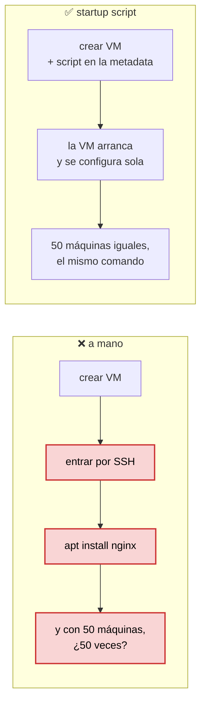
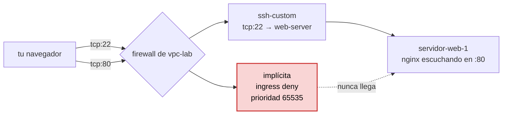

# Etapa 6 — VM con startup script

Los entregables son [`compute-engine/create-instance.sh`](../compute-engine/create-instance.sh)
y [`compute-engine/startup-script.sh`](../compute-engine/startup-script.sh).

**Aquí empieza el módulo 2 y aquí empieza el coste.** Todo lo de las etapas 1 a 5
—APIs, una identidad, un rol, una red, una regla de firewall— es gratis. Una VM
encendida, no. Lee la sección del dinero antes de lanzar el comando.

## Lo que de verdad se aprende aquí

No es "crear una máquina virtual". Eso se hace con tres clics en la consola.

Lo que mide el ejercicio es otra cosa: **la máquina nace con el nginx ya puesto,
sin que tú hayas entrado por SSH a instalarlo**. Esa es la idea de
*bootstrapping*, y es la línea que separa administrar servidores de la vieja
manera de hacerlo en la nube.



De ahí sale todo lo que viene después: si la máquina se configura sola, da igual
que se muera y nazca otra. Eso es el **MIG** de la etapa 7, y es lo que el vídeo
llama "ganado en vez de mascotas".

## Una VM es zonal

Este es el segundo concepto de la etapa, y se apoya en la
[etapa 4](apuntes-etapa-04-vpc-custom.md):

| Objeto | Alcance |
|---|---|
| la red `vpc-lab` | **global** |
| la subred `subred-us-east1` | **regional** — `us-east1` |
| la VM `servidor-web-1` | **zonal** — `us-east1-b` |

Una zona es un centro de datos. Si `us-east1-b` se cae, tu máquina se cae con
ella, y no hay nada dentro de la VM que lo evite. La resiliencia no se arregla en
la máquina: se arregla poniendo **varias** máquinas en **varias** zonas, que es
justo lo que hace el MIG regional de la etapa 7.

La zona también manda en un detalle práctico: la VM tiene que estar en una zona
**de la región de su subred**. `us-east1-b` con `subred-us-east1` encaja;
`europe-west1-b` con esa misma subred no arrancaría.

## El comando

```powershell
gcloud compute instances create servidor-web-1 --zone=us-east1-b --machine-type=e2-micro --subnet=subred-us-east1 --tags=web-server --metadata-from-file=startup-script=compute-engine/startup-script.sh
```

En una sola línea. El `\` del vídeo es de bash.

| Flag | Qué hace |
|---|---|
| `servidor-web-1` | nombre. Minúsculas y guion, como manda la convención |
| `--zone=us-east1-b` | la zona del laboratorio. Sin esto usaría la del perfil `lab` |
| `--machine-type=e2-micro` | 2 vCPU compartidas y 1 GB de RAM. La más pequeña razonable |
| `--subnet=subred-us-east1` | **la subred de la etapa 4**. Sin esto la VM iría a la red `default` |
| `--tags=web-server` | **la etiqueta de la etapa 5**. Sin esto, la regla `ssh-custom` no le aplica y no puedes ni entrar |
| `--metadata-from-file=startup-script=...` | **el ejercicio**. El contenido del archivo se copia a la metadata con la clave `startup-script` |

Los tres del medio son el hilo del laboratorio: la red de la 4, la etiqueta de la
5 y el script de la 6, cosidos en un solo comando.

Dos flags que no están y conviene conocer:

- **`--image-family=debian-12 --image-project=debian-cloud`** — sin ellos gcloud
  elige una imagen de Debian por su cuenta. Funciona, pero en un script serio la
  imagen se escribe: si mañana cambian el valor por defecto, tu máquina cambia de
  sistema operativo sin que tú toques nada.
- **`--no-address`** — arranca la VM **sin IP externa**. Es lo correcto para
  cualquier cosa que no tenga que ser pública, y ahorra dinero. Aquí no se usa
  porque el ejercicio consiste precisamente en abrir la web desde tu navegador.

## El startup script

```bash
#!/bin/bash
apt-get update
apt-get install -y nginx
systemctl enable nginx
systemctl start nginx
```

Cuatro líneas y varias cosas que saber:

**Corre como root.** No hay `sudo` porque no hace falta: lo lanza el agente de
Google, que ya es root. Y ese es el motivo de que
`compute.instances.setMetadata` fuera uno de los permisos peligrosos de la
[etapa 3](apuntes-etapa-03-rol-personalizado.md): quien puede escribir la
metadata de una VM puede escribir un startup script, y eso es **root dentro de la
máquina**.

**⚠ Corre en CADA arranque, no solo en el primero.** El vídeo dice "cuando la
máquina arranca por primera vez" y es inexacto. Si paras y enciendes la VM, el
script vuelve a ejecutarse entero. Por eso tiene que ser **idempotente** —el
mismo concepto que el `custom_role.py` de la etapa 3—: `apt-get install -y` sobre
un paquete ya instalado no hace nada, y `systemctl start` sobre un servicio ya
arrancado tampoco. Un script que hiciera `echo algo >> /etc/fichero` acabaría con
la línea repetida veinte veces.

**⚠ La metadata no es un sitio para secretos.** Cualquier proceso dentro de la VM
puede leerla entera con una petición HTTP normal:

```bash
curl -H "Metadata-Flavor: Google" http://169.254.169.254/computeMetadata/v1/instance/attributes/startup-script
```

Nada de contraseñas ni claves ahí dentro. Para eso está Secret Manager.

**El `-y` no es opcional.** Sin él, `apt-get install` se para a preguntar y no hay
nadie al otro lado para contestar. El script se quedaría colgado para siempre.

En Debian, instalar el paquete `nginx` ya lo arranca y lo deja habilitado, así
que las dos últimas líneas son redundantes. Se dejan porque hacen explícito lo
que quieres y porque en otras distribuciones sí hacen falta.

Variantes que existen: `shutdown-script` para el apagado, y
`windows-startup-script-ps1` si la máquina fuera Windows.

## ⚠ El puerto 80 no está abierto

Este es el punto donde el ejercicio se atasca, y no es culpa tuya.

La [etapa 5](apuntes-etapa-05-firewall-network-tags.md) creó **una** regla:
`ssh-custom`, que abre `tcp:22`. La web va por `tcp:80`, y para el 80 no hay
ninguna regla, así que manda la regla implícita de **ingress deny**.



El síntoma engaña: no da "conexión rechazada", se queda **cargando hasta que
expira**. Un paquete descartado por el firewall no contesta nada, así que el
navegador espera. Es fácil pensar que el nginx todavía se está instalando.

La segunda regla:

```powershell
gcloud compute firewall-rules create http-custom --network=vpc-lab --action=allow --direction=ingress --rules=tcp:80 --source-ranges=0.0.0.0/0 --target-tags=web-server
```

Aquí el `0.0.0.0/0` sí tiene sentido: un servidor web público está para que entre
cualquiera. Es en el 22 donde era discutible.

Esta misma regla es la que falta en el vídeo en el ejercicio 18, y por eso el
uptime check le sale en rojo y lo deja así.

## Comprobaciones de la etapa

**1. La máquina está viva y tiene IP externa**

```powershell
gcloud compute instances list --filter="name:servidor-web-1"
```

Esperado: `RUNNING`, zona `us-east1-b`, una IP interna del `10.10.0.x` —de la
subred de la etapa 4— y una externa.

**2. La web responde**

```powershell
(Invoke-WebRequest http://IP_EXTERNA).StatusCode
```

Esperado: **200**, y `Welcome to nginx` en el cuerpo.

Ten paciencia el primer minuto. La VM aparece como `RUNNING` **antes** de que el
startup script haya terminado: `RUNNING` significa que el sistema operativo
arrancó, no que tu script acabara. El `apt-get` tarda lo suyo.

**3. La medida de verdad: el script se ejecutó solo**

Si la 2 da 200, ya está probado: nadie entró por SSH a instalar nada. Para verlo
por dentro:

```powershell
gcloud compute ssh servidor-web-1 --zone=us-east1-b
```

y ya dentro de la máquina:

```bash
sudo journalctl -u google-startup-scripts.service
systemctl status nginx
```

El primero es el log del agente ejecutando tu script, línea a línea. Es el sitio
donde mirar cuando un startup script no hace lo que esperabas — y como corre sin
nadie delante, es el **único** sitio.

## El dinero

Aquí está el aviso que pide la convención del laboratorio.

| Concepto | Se paga mientras... |
|---|---|
| vCPU y RAM del `e2-micro` | la VM esté **encendida** |
| disco de arranque, 10 GB | la VM **exista**, encendida o parada |
| IP externa efímera | esté **asignada a una VM encendida** |
| tráfico de salida | lo haya |

Órdenes de magnitud: un `e2-micro` en `us-east1` ronda los **6 USD al mes**
encendido a todas horas, el disco alrededor de **1 USD**, y la IP externa unos
pocos céntimos al día. El número que vale es el de la consola de Facturación, no
este.

Tres matices que importan más que las cifras:

- **Parar la VM no la borra.** Parada no pagas CPU ni RAM, pero **el disco sigue
  contando**. Para no pagar nada hay que borrar la instancia.
- **La IP efímera se libera al parar la VM.** El `plan.md` avisa de que "la IPv4
  externa se cobra aunque pares la VM": eso es cierto para una IP **estática
  reservada**, que se paga —y más cara— precisamente cuando no está enganchada a
  nada. La de este ejercicio es efímera, así que al parar la máquina desaparece,
  no se cobra, y **al volver a encenderla te dan otra distinta**.
- **El nivel gratuito.** `us-east1` es una de las tres regiones con un `e2-micro`
  siempre gratis al mes. No cuentes con ello: la cuenta de facturación está
  **compartida con el proyecto del curso**, el nivel gratuito va por cuenta y no
  por proyecto, y el disco que crea este comando no es del tipo que entra en el
  nivel gratuito.

### Al cerrar la sesión

```powershell
# parar: deja de pagar CPU y RAM, conserva el disco y los datos
gcloud compute instances stop servidor-web-1 --zone=us-east1-b

# borrar: no queda nada, con su disco
gcloud compute instances delete servidor-web-1 --zone=us-east1-b
```

La etapa 7 empieza parando esta máquina, así que si vas seguido, `stop`. Si
cierras el laboratorio por hoy, `delete`: el comando de creación está guardado y
rehacerla cuesta un minuto.

Y la comprobación de que no queda nada encendido, que es la del ejercicio 20:

```powershell
gcloud compute instances list
```
