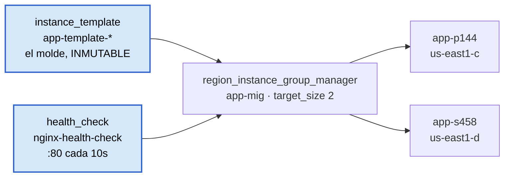

# Etapa 7 — Managed Instance Group

El entregable es [`terraform/mig.tf`](../terraform/mig.tf).

**Esta etapa es la más cara hasta ahora:** dos VMs encendidas, dos discos y dos
IPs externas, del orden de 12-14 USD al mes si se queda arriba. Y no se apaga
sola. Lee el final antes de aplicar.

## Lo que de verdad se aprende aquí

La [etapa 6](apuntes-etapa-06-vm-startup-script.md) creó **una** máquina y le
puso nombre. Esta crea un **grupo** y ni siquiera elige los nombres: salen
`app-p144`, `app-s458`, con sufijo aleatorio.

Ese cambio de nombres no es cosmético. Es el paso de **mascota a ganado**:

| | Mascota (etapa 6) | Ganado (etapa 7) |
|---|---|---|
| Nombre | lo eliges tú | aleatorio, da igual |
| Si se muere | la arreglas | nace otra |
| Cuántas hay | una, la tuya | las que pidas: `target_size` |
| Si falla la zona | se cae contigo | quedan las de las otras zonas |

Y solo es posible gracias a la etapa anterior: **porque la máquina se configura
sola** al arrancar, da igual que muera y nazca otra. Sin el startup script, una
instancia repuesta nacería vacía y el grupo no serviría de nada.

## Las tres piezas



**La plantilla es inmutable.** No se edita: se sustituye. De ahí los dos detalles
que parecen rarezas de Terraform y no lo son:

- `name_prefix = "app-template-"` en vez de `name`, para que cada versión tenga
  un nombre distinto.
- `create_before_destroy = true`, porque Terraform no puede borrar la plantilla
  vieja mientras el grupo la esté usando.

Los dos van juntos siempre. Sin ellos, cualquier cambio en la plantilla acaba en
un error de dependencia.

**El grupo es regional, no zonal.** `google_compute_region_instance_group_manager`
reparte las instancias entre las zonas de `us-east1`. Aquí está la respuesta al
problema que dejó abierta la etapa 6: una zona caída ya no se lleva todo.

**El health check es lo que convierte "reponer" en auto-healing.** Sin él, el
grupo solo sabe **contar**: si hay menos de dos, crea una. Con él, además
**pregunta** a cada máquina si sigue sirviendo, y sustituye a la que esté viva
pero rota — nginx caído, proceso colgado. Son dos niveles distintos de "funciona".

| Parámetro | Valor | Qué significa |
|---|---|---|
| `check_interval_sec` | 10 | cada cuánto pregunta |
| `timeout_sec` | 5 | cuánto espera la respuesta |
| `healthy_threshold` | 2 | dos respuestas buenas seguidas → sana |
| `unhealthy_threshold` | 3 | tres fallos seguidos → enferma, se sustituye |
| `initial_delay_sec` | 300 | ⚠ margen antes de empezar a juzgar |

⚠ **El `initial_delay_sec` es el parámetro que más daño hace si se queda corto.**
Una máquina recién nacida tarda en hacer `apt-get update` e instalar nginx. Si el
plazo expira antes, el grupo la declara enferma y la mata **mientras estaba
arrancando bien**, y entra en un bucle de crear-matar que cuesta dinero y
desconcierta. 300 segundos es generoso a propósito.

Los sondeos llegan desde `130.211.0.0/22` y `35.191.0.0/16`, rangos fijos de
Google. Aquí pasan porque `http-custom` abre el puerto 80 desde `0.0.0.0/0`; en un
proyecto serio se escribiría una regla solo para esos dos rangos.

## Lo que cuentan tus propias instancias

Estado real del grupo, consultado el 29 de septiembre:

| Instancia | Zona | Creada |
|---|---|---|
| `app-s458` | **us-east1-d** | 3 sept, 15:58:04 |
| `app-p144` | **us-east1-c** | 3 sept, **16:05:47** |

Dos cosas se leen ahí sin necesidad de más comandos:

**Están en zonas distintas.** `us-east1-c` y `us-east1-d`, y ninguna en la
`us-east1-b` donde vivía la VM de la etapa 6. El grupo regional reparte solo, sin
que nadie le diga dónde poner cada una. Eso es la resiliencia del ejercicio, no
una casualidad.

**Se crearon con 7 minutos y 43 segundos de diferencia.** Si el grupo hubiera
levantado las dos de golpe al aplicar, tendrían casi la misma marca de tiempo. Esa
diferencia es la huella de una **reposición**: una instancia desapareció y el
grupo fabricó otra. Es exactamente la prueba de auto-healing que pide el
`plan.md`, y quedó grabada en los metadatos.

> 🔧 **Un cabo suelto.** `gcloud compute instance-groups managed list-instances`
> devuelve la columna `HEALTH_STATE` **vacía**, aunque la política de auto-healing
> sí está configurada (`describe` muestra el health check y el
> `initialDelaySec: 300`) y el grupo está estable (`isStable: true`). No es que
> falte el sondeo: las dos máquinas llevan 26 días vivas, así que nadie las está
> matando. Para verlo por dentro:
>
> ```powershell
> gcloud compute instance-groups managed describe app-mig --region=us-east1
> gcloud compute health-checks describe nginx-health-check
> ```

## Comprobaciones de la etapa

**1. Las dos instancias**

```powershell
gcloud compute instance-groups managed list-instances app-mig --region=us-east1
```

Esperado: dos filas, las dos `RUNNING`, y —esto es lo que hay que mirar— en
**zonas distintas**.

**2. La prueba de verdad: auto-healing**

Borra una a mano y vuelve a listar a los dos minutos:

```powershell
gcloud compute instances delete app-p144 --zone=us-east1-c
gcloud compute instance-groups managed list-instances app-mig --region=us-east1
```

Esperado: **siguen siendo dos**, con un nombre nuevo en lugar de la borrada.

Y de aquí sale el aviso más importante de la etapa: ⚠ **borrar las instancias a
mano no sirve para ahorrar.** El grupo las repone en un par de minutos. Es el
error que parece obvio en frío y que todo el mundo comete una vez.

## El dinero

| Concepto | Se paga mientras... |
|---|---|
| 2 × vCPU y RAM `e2-micro` | las instancias estén **encendidas** |
| 2 × disco de 10 GB | las instancias **existan** |
| 2 × IP externa efímera | estén asignadas a instancias encendidas |

El nivel gratuito cubre **un** `e2-micro` al mes por cuenta de facturación. Aquí
hay dos, y la cuenta está compartida con el proyecto del curso, así que ese
colchón no cubre nada en la práctica.

> 🔧 **Lo que pasó de verdad:** estas dos instancias se crearon el 3 de septiembre
> y seguían encendidas el **29 de septiembre**. Veintiséis días. El `plan.md` ya
> tenía escrito el checklist de apagado y el `mig.tf` ya tenía el aviso en un
> recuadro — y aun así ocurrió. La lección de la etapa no es el comando de apagado,
> es que **el apagado hay que hacerlo el mismo día**, porque nada te lo va a
> recordar.

### Al cerrar la sesión

Dos formas buenas, según si vas a volver:

```powershell
# a) bajar el grupo a 0: conserva grupo y plantilla (gratis), apaga lo que cuesta
#    -> poner target_size = 0 en mig.tf y aplicar
terraform -chdir=terraform apply

# b) destruirlo
terraform -chdir=terraform destroy '-target=google_compute_region_instance_group_manager.app_mig'
```

Las comillas del `-target` no son opcionales en PowerShell: sin ellas parte el
argumento en el punto y Terraform recibe un recurso sin nombre.

Y la comprobación, que es la del ejercicio 20:

```powershell
gcloud compute instances list
```

Esperado: vacío.
