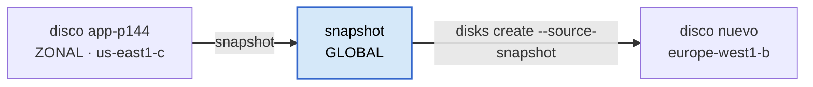

# Etapa 8 — Snapshots con Python

Los entregables son [`compute-engine/backup_vm.py`](../compute-engine/backup_vm.py)
—este sí se ejecuta— y el cuaderno
[`scripts/etapa-08-snapshots.sh`](../scripts/etapa-08-snapshots.sh).

## Lo que de verdad se aprende aquí

No es "hacer una copia de seguridad". Son tres ideas, y las tres cambian cómo se
piensa la infraestructura.

**El disco no está dentro de la máquina.** Es almacenamiento en red, conectado
por cable a la VM. De ahí salen dos consecuencias que parecen magia y no lo son:
se puede fotografiar sin apagar la máquina, y sobrevive a la máquina.

**Un disco es zonal; un snapshot es global.** Ese salto de alcance es el ejercicio
entero. Fíjate en que ningún comando de la etapa pide la zona del snapshot,
mientras que el script exige `--zone` para el disco.



Así se "mueve una máquina de continente": no se mueve nada. Se fotografía el
disco y se revela la foto en otra región. Es la misma lógica de la
[etapa 6](apuntes-etapa-06-vm-startup-script.md) —la máquina es desechable, lo
que importa es lo que la hace nacer— aplicada esta vez a los datos.

**Son incrementales.** El primer snapshot copia el disco entero. Los siguientes
guardan solo los bloques que cambiaron. Y aun así **cada uno se restaura por sí
solo**: no hay que ir encadenando copias como con los backups incrementales
clásicos. Por dentro comparten bloques; por fuera cada snapshot es completo.

## El código, en tres decisiones

**El id del proyecto se lee de `terraform.tfvars`.** Misma función que en
[`custom_role.py`](../scripts/custom_role.py) de la
[etapa 3](apuntes-etapa-03-rol-personalizado.md), y por el mismo motivo: en este
laboratorio el id vive **una sola vez**. Es lo que en el proyecto del curso
estaba copiado en tres sitios que se desincronizaban.

**`source_disk` va por `self_link`, no por nombre.** El `self_link` es la URL
completa del disco:

```
https://www.googleapis.com/compute/v1/projects/gcp-lab-jona-01/zones/us-east1-c/disks/app-p144
```

Tiene sentido: el snapshot vive fuera de la zona, así que necesita la dirección
completa de su origen. Un nombre suelto sería ambiguo — podría haber un
`app-p144` en cada zona.

**`insert()` devuelve una operación, no un snapshot.** La llamada vuelve
enseguida mientras Google sigue trabajando; `operacion.result(timeout=600)` es lo
que espera de verdad. Sin ese `.result()` el script imprimiría "hecho" con el
snapshot a medio crear.

Y el nombre lleva la fecha y la hora dentro (`snapshot-<disco>-<fecha>`) porque
los nombres son únicos y globales: con uno fijo, la segunda ejecución fallaría
con un 409 — y la segunda ejecución es justo la medida del ejercicio.

La librería también es distinta de la de la etapa 3: `google-cloud-compute`, con
clases de verdad y autocompletado, en vez de `googleapiclient.discovery`, que se
fabrica los métodos al vuelo.

## La medida real

Dos ejecuciones sobre el mismo disco `app-p144` (10 GB, `pd-standard`):

| Snapshot | Creado | Ocupa | Tardó |
|---|---|---|---|
| `snapshot-app-p144-20260903-192226` | 3 sept | 709.560.320 B = **677 MB** | — |
| `snapshot-app-p144-20260929-165552` | 29 sept | 444.035.520 B = **423 MB** | 88,8 s |

Los dos `READY` y con `storageBytes` en `UP_TO_DATE`, así que las cifras son
definitivas, no provisionales.

El segundo ocupa un **37% menos**. Es incremental, pero mucho menos espectacular
de lo que promete el cuaderno ("una fracción"), y el motivo es la lección de
verdad:

> 🔧 **Entre los dos snapshots pasaron 26 días con la VM encendida.** Los 423 MB
> no son "casi nada": son los bloques que el sistema tocó en ese tiempo —logs,
> actualizaciones de paquetes, caché de apt—. Un snapshot incremental no mide el
> tiempo transcurrido: mide **cuánto ha cambiado el disco**.

La demostración limpia es lanzarlo una tercera vez seguida, sin dejar pasar
nada en medio: ahí el delta baja a unas decenas de MB, porque apenas se ha
escrito nada. Merece la pena hacerlo, porque es la diferencia entre creerse la
teoría y verla.

Y explica por qué 10 GB de disco caben en 677 MB de snapshot: no copia el disco
entero, copia los **bloques escritos**, y además los comprime. Un disco recién
instalado está casi vacío.

## Comprobaciones de la etapa

**1. La del ejercicio**

```powershell
gcloud compute snapshots list --format="table(name,status,diskSizeGb,storageBytes)"
```

Esperado: los dos `READY`, `storageBytes > 0`, y el segundo menor que el primero.
Si el segundo sale en 0 o igual que el primero, espera unos minutos: GCP tarda en
cuadrar esa cifra. La columna `storageBytesStatus` dice si ya es definitiva
(`UP_TO_DATE`) o provisional.

**2. De dónde salió cada uno**

```powershell
gcloud compute snapshots list --format="table(name,sourceDisk.basename(),creationTimestamp)"
```

**3. Que es global**

Ninguno de los dos comandos pide zona. Ese es el contraste con
`gcloud compute disks list`, donde la zona es parte de la identidad del recurso.

## El dinero

| Concepto | Se paga mientras... |
|---|---|
| el snapshot | **exista**. No caduca solo, nunca |
| el disco de origen | exista, encendido o parado |

Un snapshot se factura por lo que ocupa, no por el tamaño del disco: estos dos
juntos son algo más de 1 GB, céntimos al mes. El problema no es el precio, es el
**goteo**: nadie recuerda haberlos creado y se quedan ahí para siempre. Es una de
las líneas que más aparece en facturas de GCP que nadie entiende.

⚠ **Borrar un snapshot puede no liberar el espacio que esperas.** Si otro
depende de sus bloques, GCP los mueve al siguiente de la cadena antes de borrar —
no pierde datos nunca, pero tampoco te devuelve todo el espacio.

En un proyecto real esto no se hace a mano: se define una *resource policy* de
snapshots programados con retención, que los crea y los caduca sola. Es el mismo
salto que la `lifecycle_rule` del bucket de la etapa 14: la regla la pone la
infraestructura, no una persona acordándose.

### Al cerrar la sesión

```powershell
# los snapshots, si no los necesitas para la etapa 9
gcloud compute snapshots list --format="value(name)"
gcloud compute snapshots delete NOMBRE

# y lo caro de verdad: las dos VMs del MIG de la etapa 7
terraform -chdir=terraform destroy '-target=google_compute_region_instance_group_manager.app_mig'
```

Las comillas del `-target` no son opcionales en PowerShell: sin ellas parte el
argumento en el punto y Terraform recibe un recurso sin nombre.
