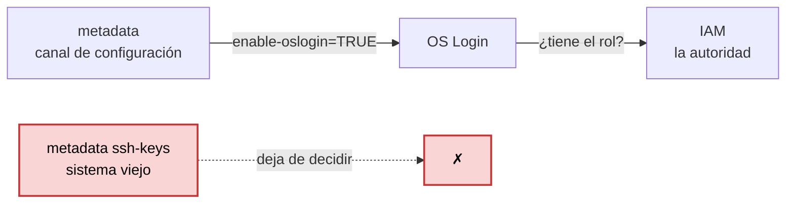

# Etapa 9 — OS Login

El entregable es [`compute-engine/os-login-ssh.sh`](../compute-engine/os-login-ssh.sh).

Coste: solo la VM del paso previo. La metadata, OS Login y el perfil POSIX son
gratis.

## Lo que de verdad se aprende aquí

No es "conectarse por SSH". Es **quién decide** que puedas conectarte, y la
respuesta cambia de sitio:

| | Sin OS Login | Con OS Login |
|---|---|---|
| La pregunta | ¿tienes una **clave** en la metadata? | ¿tienes el **rol** en IAM? |
| Dónde vive el permiso | en una lista copiada en cada máquina | en IAM, en un solo sitio |
| Quién eres dentro | tu usuario local (`jona`) | tu identidad de Google |
| Cuándo se comprueba | al copiar la clave, y ya | **en cada conexión** |
| Revocar el acceso | borrar la clave en N sitios | quitar un rol, **una vez** |
| Auditoría | la clave no dice quién es | cada sesión ligada a una persona |

Con tres máquinas, repartir claves funciona. Con quinientas y cincuenta
ingenieros, es una lista imposible de mantener — y cuando alguien se va de la
empresa hay que ir borrando su clave servidor por servidor, esperando que no
quede ninguna copia suelta.

**Y OS Login no está por encima de IAM: le pregunta a IAM.** La analogía: IAM es
la lista de invitados y OS Login es el portero que la consulta antes de dejarte
pasar. El portero no manda más que la lista; lo que hace es **obligar a que se
consulte**, en vez de dejar entrar a cualquiera que traiga una llave copiada de
antes.

La forma corta: **IAM decide, OS Login aplica.** Es el punto donde una regla de
IAM se convierte en un usuario de Linux con su UID y su home.

## El detalle elegante del ejercicio

OS Login se enciende **por metadata**:

```powershell
gcloud compute project-info add-metadata --metadata enable-oslogin=TRUE
```

O sea que se usa el **canal viejo de configuración** —el mismo por el que viajó
el `startup-script` de la [etapa 6](apuntes-etapa-06-vm-startup-script.md)— para
desactivar el **sistema viejo de acceso**.



La metadata no desaparece: sigue siendo cómo se configura una VM desde fuera. Lo
que cambia es que **`ssh-keys` deja de mandar**.

### ⚠ La trampa: la metadata no valida las claves

Es un almacén de clave-valor y acepta **cualquier** texto. Escribe
`enable-os-login` —con guion entre `os` y `login`— y te responderá `Updated`
igual de contenta, dejando OS Login **apagado sin que nada te avise**.

| Error | Qué pasa |
|---|---|
| `enable-os-login` | ⚠ **funciona en silencio**: guarda la clave y OS Login sigue apagado |
| `project-onfo` | falla y te avisa; `gcloud` hasta sugiere el subcomando correcto |

El segundo es el inofensivo, precisamente porque falla. Es la misma familia que un
`region = "us-central"` mal escrito: campos de texto libre que nadie valida hasta
que algo no funciona y no sabes por qué.

Y los **dos niveles**, por si algún día chocan:

- **Proyecto** (`project-info add-metadata`) — lo heredan todas las instancias.
- **Instancia** (`instances add-metadata`) — solo esa, y **gana** sobre el proyecto.

## Lo que pasó al ejecutarlo

**El "antes" salió vacío.** La metadata del proyecto no tenía **ninguna** clave:

```powershell
gcloud compute project-info describe --format='value(commonInstanceMetadata.items[].key)'
# (nada)
```

> 🔧 Eso hace este laboratorio más limpio que el proyecto anterior, donde el orden
> fue el inverso: allí se conectó por SSH **antes** de activar OS Login, así que
> `gcloud` escribió una clave `ssh-keys` en la metadata del proyecto, y después
> hubo que convivir con ella. Aquí OS Login se activó primero, así que la metadata
> tiene **una sola clave**, `enable-oslogin`, y nunca ha existido una lista de
> llaves repartidas. Es la diferencia entre arreglar un sistema heredado y
> empezar bien.

**El "después", una sola línea:**

```
{'key': 'enable-oslogin', 'value': 'TRUE'}
```

**La prueba, sin depender de leer el prompt:**

```powershell
gcloud compute ssh servidor-web-1 --zone=us-east1-b --command="whoami"
# jona_samah_gmail_com
```

Ese nombre **es** el ejercicio. No es `jona` (el usuario de Windows) ni `root`:
Google lo derivó de `jona.samah@gmail.com` convirtiendo el punto y la arroba en
guiones bajos. Con una cuenta de Workspace sería solo `jona_samah`, sin el
dominio.

**Y lo que NO apareció:** el mensaje `Updating project ssh metadata...`. Con OS
Login activo, `gcloud` no reparte tu clave por la metadata: la sube a tu perfil.
Si ese mensaje sale, OS Login no está puesto.

**El perfil POSIX que Google fabricó solo:**

```powershell
gcloud compute os-login describe-profile
```

| Campo | Valor |
|---|---|
| usuario | `jona_samah_gmail_com` |
| UID | `733533204` |
| home | `/home/jona_samah_gmail_com` |

Nadie creó esa cuenta a mano. No hubo un administrador ni un script: Google generó
el usuario, el UID y el directorio en cuanto validó la identidad contra IAM. El
UID es el mismo en **todas** las máquinas del proyecto, que es justo lo que en un
parque de servidores clásico cuesta un sistema entero (LDAP) conseguir.

> 🔧 **En Windows, `gcloud compute ssh` usa PuTTY, no OpenSSH.** De ahí los avisos
> de la primera ejecución (`The PuTTY PPK SSH key file for gcloud does not exist`)
> y la pregunta de Plink sobre la huella del servidor:
>
> ```
> Store key in cache? (y/n, Return cancels connection, i for more info)
> ```
>
> Hay que contestar `y` para que siga. Y ojo con esto al usar `--command`: la
> respuesta del comando se imprime **en la misma línea** que esa pregunta, así que
> el `jona_samah_gmail_com` aparece pegado al texto de Plink y parece parte de él.
> En Linux la primera conexión no pregunta así: usa OpenSSH y añade la huella a
> `known_hosts` con un aviso.

## Los roles

| Rol | Qué da |
|---|---|
| `roles/compute.osLogin` | entrar por SSH, usuario normal, **sin sudo** |
| `roles/compute.osAdminLogin` | entrar **con sudo** |

Aquí entras porque eres `roles/owner` del proyecto, y owner ya incluye ambos.

Y ahí está el valor de todo el ejercicio: **revocar el acceso de alguien es
quitarle un rol en IAM, una vez.** El siguiente intento de conexión se rechaza al
instante, sin tocar ninguna máquina, aunque su clave privada siga en su portátil.
Es el mismo principio de menor privilegio de la
[etapa 3](apuntes-etapa-03-rol-personalizado.md), aplicado ahora al acceso por
SSH.

## Comprobaciones de la etapa

```powershell
# 1. la clave quedó bien escrita
gcloud compute project-info describe --format="value(commonInstanceMetadata.items)"

# 2. la del ejercicio
gcloud compute ssh servidor-web-1 --zone=us-east1-b --command="whoami"

# 3. el perfil POSIX
gcloud compute os-login describe-profile
```

En PowerShell, si al pegar un `--format="..."` el prompt se queda en `>>`, es que
se perdió una comilla: `Ctrl+C` y repite con **comillas simples**.

## Al cerrar la sesión

```powershell
gcloud compute instances delete servidor-web-1 --zone=us-east1-b
```

La metadata `enable-oslogin` puede quedarse: es gratis y deja el proyecto mejor de
como estaba. Si quisieras dejarlo como lo encontraste:

```powershell
gcloud compute project-info remove-metadata --keys=enable-oslogin
```

Y un detalle que se vio al recrear la VM: su IP externa fue `34.23.40.215`, **la
misma que tenía una instancia del MIG destruida un rato antes**. Las IPs efímeras
vuelven al pozo de la región y se reasignan. Por eso nada que dependa de una IP
fija puede construirse sobre una efímera — y por eso existen las estáticas
reservadas, que se pagan justo para que eso no pase.
