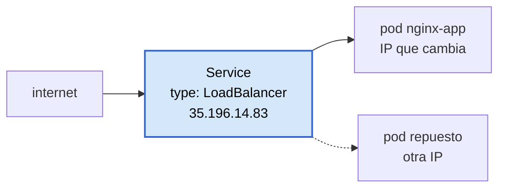

# Etapa 11 — `kubectl`, deployments y LoadBalancer

El entregable es [`gke/create-services.sh`](../gke/create-services.sh), y **se
ejecuta desde Cloud Shell**, no desde este PC.

## Por qué Cloud Shell

En este equipo no hay `kubectl` y no se puede instalar: el SDK está en
`C:\Program Files (x86)` y `gcloud components install` pide permisos de
administrador. Cloud Shell es una terminal Linux gratis **dentro del navegador**
(console.cloud.google.com → icono `>_`), con `gcloud`, `kubectl` y el
`gke-gcloud-auth-plugin` ya instalados y ya autenticados.

🔧 Tropiezo real: el primer intento fue lanzar `kubectl get nodes` **en
PowerShell**, y respondió *«El término 'kubectl' no se reconoce»*. El
`get-credentials` sí funciona en el PC —es `gcloud`— pero escribe un
`~/.kube/config` que aquí nadie puede usar. Las dos mitades del ejercicio viven en
sitios distintos.

## Lo que de verdad se aprende aquí

**El pod es la unidad mínima, no el contenedor.** Un pod puede tener varios
contenedores que comparten red y almacenamiento.

**Los pods son efímeros, y ahí está el problema que resuelve la etapa.** Cuando un
pod muere y nace otro, su IP interna cambia. No se puede apuntar a ella.



Un **Service** es una dirección estable y un reparto de carga delante de los pods
que haya, con la IP que tengan. Y `--type=LoadBalancer` hace que GCP aprovisione un
balanceador de verdad con IP externa; el tipo por defecto, `ClusterIP`, solo es
alcanzable desde dentro del clúster.

**Los dos niveles de "que no se caiga":**

| | Repone | Nivel |
|---|---|---|
| MIG (etapa 7) | **máquinas** | infraestructura |
| Deployment (esta etapa) | **pods** | aplicación |

El deployment es al pod lo que el MIG a la VM: alguien que cuenta y repone.

## Los dos comandos

```bash
kubectl create deployment nginx-app --image=nginx:latest
kubectl expose deployment nginx-app --type=LoadBalancer --port 80 --target-port 80
```

| Flag | Qué hace |
|---|---|
| `--type=LoadBalancer` | pide a GCP un balanceador con IP externa |
| `--port 80` | por donde entras tú desde fuera |
| `--target-port 80` | donde escucha nginx **dentro** del contenedor |

Los dos puertos coinciden aquí; si la app escuchara en 8080, esa sería la
diferencia entre los dos flags. El vídeo no pone `--target-port`, y funciona de
casualidad porque coinciden.

## Lo que se midió

Salida real del `kubectl get svc nginx-app -w`:

```
NAME        TYPE           CLUSTER-IP       EXTERNAL-IP    PORT(S)        AGE
nginx-app   LoadBalancer   34.118.226.145   <pending>      80:30159/TCP   23s
nginx-app   LoadBalancer   34.118.226.145   <pending>      80:30159/TCP   52s
nginx-app   LoadBalancer   34.118.226.145   35.196.14.83   80:30159/TCP   52s
```

**52 segundos** en aprovisionar el balanceador. Tres cosas que leer ahí:

**Dos IPs, dos papeles.** `34.118.226.145` es la `CLUSTER-IP`, interna, solo desde
dentro del clúster. `35.196.14.83` es el balanceador real de GCP. El mismo Service
tiene las dos caras.

**`80:3XXXX/TCP` son dos puertos, no uno.** El 80 es por donde entras; el 30159 es
el **NodePort**, el puerto alto que Kubernetes abre en cada nodo para enrutar hacia
los pods. No lo eliges tú y cambia si recreas el Service.

**El `-w` no termina solo.** Deja el comando mirando y escribe una línea por cada
cambio; parece que sigue procesando cuando en realidad ya acabó. `Ctrl+C` para
salir — el ejercicio terminó en la tercera línea.

Y la comprobación desde fuera de Google:

```
HTTP/1.1 200 OK
Server: nginx/1.31.6
<title>Welcome to nginx!</title>
```

⚠ En el navegador, **con `http://` delante**. Si escribes la IP a secas, Chrome
prueba `https://` primero, no hay nadie en el 443 y se queda cargando hasta que
expira. Es el mismo síntoma que el firewall cerrado de la
[etapa 6](apuntes-etapa-06-vm-startup-script.md) con otra causa — y la forma de
distinguirlos es `curl -I http://IP` desde Cloud Shell: si responde 200, el
problema está en tu navegador, no en la infraestructura.

## El contraste que resume el módulo

La **misma** página de nginx, dos veces en este laboratorio:

| | Etapa 6 | Etapa 11 |
|---|---|---|
| Qué hiciste | crear VM, escribir startup script, poner tag, abrir firewall | **dos comandos** |
| Cómo llegó nginx | `apt-get install` dentro de la máquina | imagen `nginx:latest` ya hecha |
| Cómo se alcanza | IP externa de la VM + regla a mano | un Service de tipo LoadBalancer |
| Versión | `nginx/1.22.1`, la de Debian 12 | `nginx/1.31.6`, la de la imagen oficial |

Y las reglas de firewall las creó **GKE solo**:

```powershell
gcloud compute firewall-rules list --filter="name~k8s-"
```

Verás un par allow/deny sobre el mismo tag. No es alarmante: el allow tiene
prioridad **999** y el deny **1000**, y en GCP gana el número más bajo. Es el
contraste con el módulo 1, donde cada regla se escribió a mano.

## El dinero y el apagado

El balanceador factura aparte del clúster (regla de reenvío + IP externa, del orden
de 18 USD/mes) y **no lo gestiona Terraform**: lo creó `kubectl`.

De ahí el orden, que es lo más importante de la etapa:

```bash
# 1. EN CLOUD SHELL
kubectl delete service nginx-app
kubectl delete deployment nginx-app
```

```powershell
# 2. EN EL PC
terraform -chdir=terraform destroy '-target=google_container_cluster.primary'
```

Al revés, el balanceador queda **huérfano**: Terraform no lo conoce y nadie lo
borra, así que sigue facturando hasta que alguien lo encuentre a mano con
`gcloud compute forwarding-rules list`.

Hecho en este orden, la comprobación sale sola: tras el `delete service`, las
reglas de reenvío, el target pool y la IP externa desaparecieron los tres, sin
dejar nada atrás.
